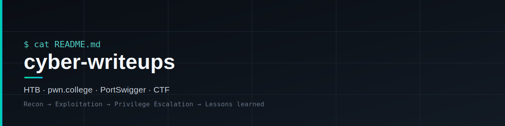

  

# cyber-writeups

Writeups et notes de progression en cybersécurité — HTB, pwn.college, PortSwigger, CTF.
Étudiant en Bachelier Sécurité des systèmes (HELMo, Liège).

## Structure

| Dossier | Contenu |
|---|---|
| [`htb/starting-point/`](htb/starting-point/) | HTB Starting Point — 13 machines (Tier 1 & 2) |
| [`htb/machines/`](htb/machines/) | Machines classiques (Easy/Medium) — Cap, Orion, diagrammes d'attaque inclus |
| [`htb/challenges/`](htb/challenges/) | Challenges HTB (Reverse, Crypto, ...) — SpookyPass |
| [`linux-luminarium/`](linux-luminarium/) | Synthèse technique Linux basée sur pwn.college (16 modules) |
| [`ctf/`](ctf/) | Writeups de CTF (Discord et autres) |
| [`web-security/portswigger/`](web-security/portswigger/) | Labs PortSwigger Web Security Academy |
| [`web-security/notes-perso.md`](web-security/notes-perso.md) | Notes persos sur les vulns web (path traversal, etc.) |

## Format d'un writeup

Chaque writeup suit la même trame : Concept → Reconnaissance → Exploitation (foothold) →
Privilege escalation → Flags → Réponses aux questions → Points clés → Leçon retenue.

## Stack / outils

`nmap` · `Wireshark` · `Burp Suite` · `Metasploit` · `hashcat` · `Python` · `Bash`

---
*En cours de construction — alimenté au fil des labs/CTF résolus.*
