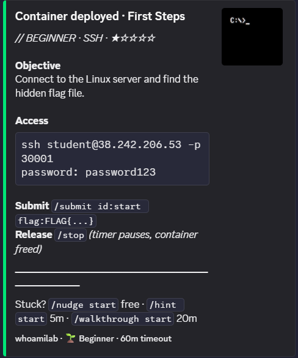
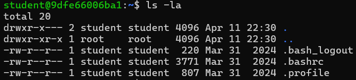
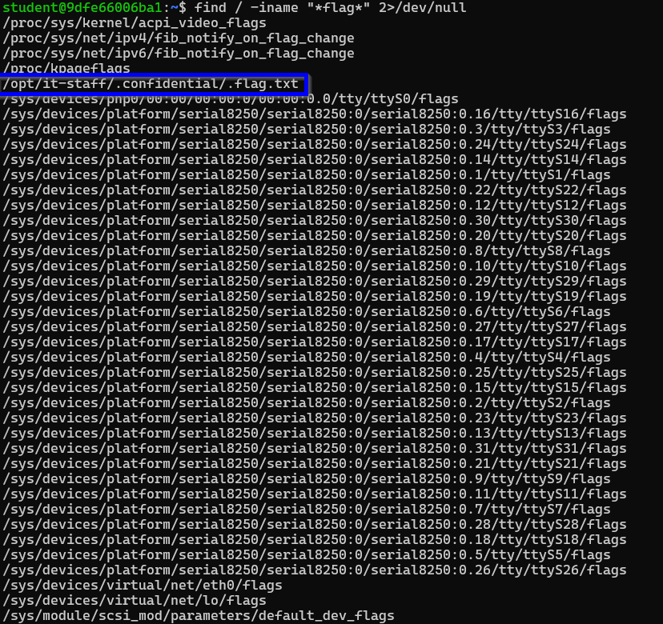
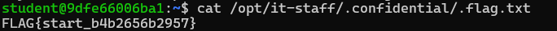
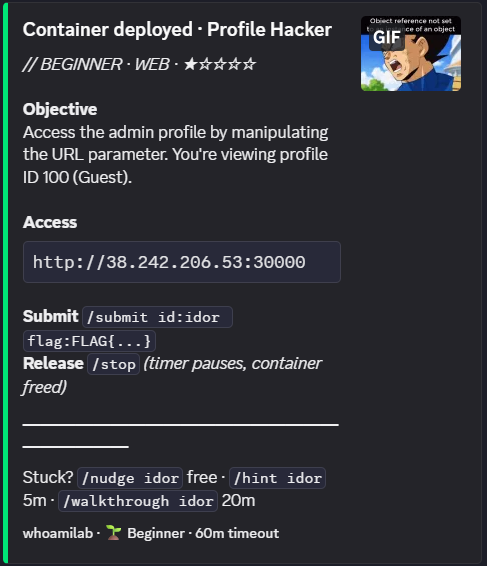
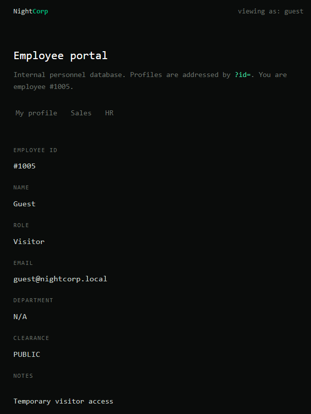
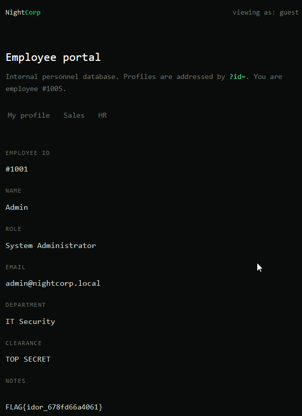
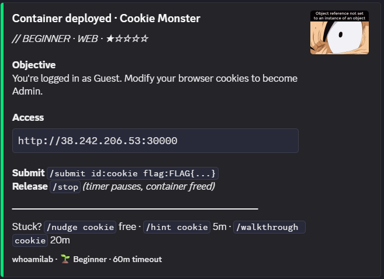
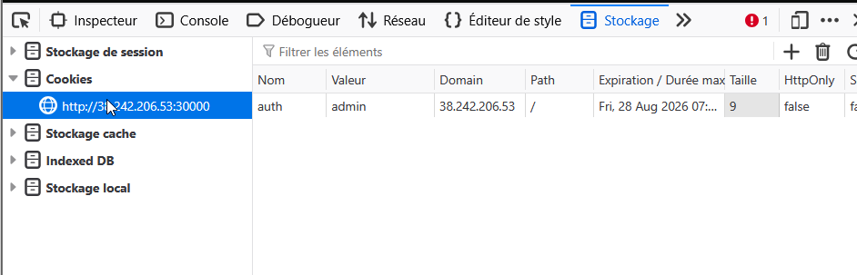
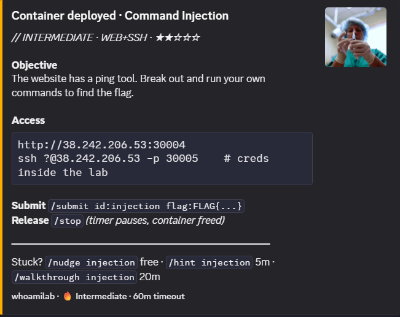

# Table of Contents

# Notes CTF — Discord

## CTF 1 — Recherche de flag sur un système Linux (SSH)

**Catégorie :** System / Linux

Capture d’énoncé du challenge

**Étape 1 : Se connecter au serveur**

    ssh student@38.242.206.53 -p 30001

Mot de passe : `password123`

**Étape 2 : Regarder où on est**

    pwd

→ `/home/student`

Ensuite :

Résultat de la commande de listing

**Étape 3 : Chercher le flag partout sur le système**

    find / -iname "*flag*" 2>/dev/null

**Ce que ça veut dire, morceau par morceau :**

- `find` = programme qui cherche des fichiers
- `/` = à partir de la racine, donc “cherche partout sur tout le
  système”
- `-iname "*flag*"` = cherche tout fichier ou dossier dont le nom
  contient le mot “flag” (le `i` ignore les majuscules/minuscules, les
  `*` veulent dire “n’importe quoi avant/après”)
- `2>/dev/null` = cache les messages d’erreur du type “permission
  denied” pour que l’affichage reste lisible

Résultat de la recherche du flag

Fichier trouvé : `/opt/it-staff/.confidential/.flag.txt`

C’est le flag. Tout le reste (les lignes avec `/proc/` et `/sys/`) est
du bruit système sans intérêt, à ignorer.

**Étape 4 : Afficher le contenu du flag**

    cat /opt/it-staff/.confidential/.flag.txt

Commande d’affichage du flag

Résultat final

## CTF 2 — IDOR sur un profil employé

**Catégorie :** Web / IDOR

Capture de la page profil

Indice sur la page : *“Profiles are addressed by ?id=. You are employee
\#1005.”* — cela indique directement comment manipuler l’URL, pas besoin
de deviner.

**Étape 1 : Ajouter le paramètre à la main**

L’URL initiale est `http://38.242.206.53:30000/` sans `?id=` visible
dans la barre — mais la page indique que le profil (#1005) est
accessible via ce paramètre.

**Étape 2 : Tester son propre ID puis un autre**

    http://38.242.206.53:30000/?id=1005

Puis, pour réaliser l’attaque IDOR :

    http://38.242.206.53:30000/?id=1001

Résultat de l’attaque IDOR

**Flag :** `FLAG{idor_678fd66a4061}`

## CTF 3 — Contournement via cookie

**Catégorie :** Web / Broken Access Control

Capture du site cible

**Étapes :**

1.  Aller sur le site
2.  Inspecter la page et aller dans le stockage (cookies)
3.  Changer la valeur du cookie en `admin`

Modification du cookie dans les outils de développement

4.  Rafraîchir la page

**Flag :** `FLAG{cookie_fb40d975b2a9}`

