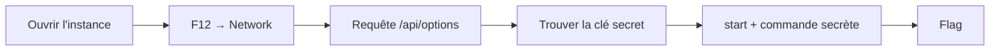

[⬅ Retour à Challenges](README.md) · [🏠 Accueil du repo](../../README.md)

# Flag Command — Web (Very Easy)

| | |
|---|---|
| **Catégorie** | Web |
| **Difficulté** | Very Easy |
| **Récompense** | 100 XP |
| **Événement** | Challenges HTB |

## Scénario

> Embark on the "Dimensional Escape Quest" where you wake up in a mysterious forest maze that's not quite of this world. Navigate singing squirrels, mischievous nymphs, and grumpy wizards in a whimsical labyrinth that may lead to otherworldly surprises. Will you conquer the enchanted maze or find yourself lost in a different dimension of magical challenges? The journey unfolds in this mystical escape!

Un jeu d'aventure textuel dans le navigateur. Le but est de trouver un flag caché derrière une commande secrète.

## Flux de résolution



## Solution pas à pas

**1. Accéder au challenge**

Ouvre l’URL de l’instance (ex: `http://154.57.164.80:31863`).

Tu arrives sur un terminal style CLI avec un scénario de forêt magique.

**2. Démarrer le jeu**

```
start
```

Le jeu propose des choix (HEAD NORTH, etc.). Tu peux jouer normalement, mais ce n’est pas nécessaire.

**3. Inspecter le trafic réseau**

- Ouvre les **DevTools** (`F12`)
- Onglet **Network**
- Recharge la page (`F5`) si besoin

Tu verras une requête vers **`/api/options`** (parfois affichée simplement `options`).

**4. Récupérer la commande secrète**

Clique sur la requête → onglet **Response** (ou Preview).

Tu obtiens un JSON de ce type :

```json
{
  "allPossibleCommands": {
    "1": ["HEAD NORTH", "HEAD WEST", "HEAD EAST", "HEAD SOUTH"],
    "2": ["GO DEEPER INTO THE FOREST", "FOLLOW A MYSTERIOUS PATH", "CLIMB A TREE", "TURN BACK"],
    "3": ["EXPLORE A CAVE", "CROSS A RICKETY BRIDGE", "FOLLOW A GLOWING BUTTERFLY", "SET UP CAMP"],
    "4": ["ENTER A MAGICAL PORTAL", "SWIM ACROSS A MYSTERIOUS LAKE", "FOLLOW A SINGING SQUIRREL", "BUILD A RAFT AND SAIL DOWNSTREAM"],
    "secret": [
      "Blip-blop, in a pickle with a hiccup! Shmiggity-shmack"
    ]
  }
}
```

La clé **`secret`** contient la commande cachée.

**5. Entrer la commande secrète**

Dans le terminal du jeu :

```
Blip-blop, in a pickle with a hiccup! Shmiggity-shmack
```

Le jeu te donne immédiatement le flag.

## Flag

```
HTB{D3v3l0p3r_t00l5_4r3_b35t__t0015_wh4t_d0_y0u_Th1nk??}
```

## Analyse technique

Le frontend charge les options via `fetch('/api/options')` et stocke le résultat dans `availableOptions`.

Dans `main.js`, la validation ressemble à :

```js
if (availableOptions[currentStep].includes(currentCommand) 
    || availableOptions['secret'].includes(currentCommand)) {
  // progression / victoire
}
```

Les options normales sont affichées à l’utilisateur, mais la clé `"secret"` ne l’est jamais. Elle n’apparaît que dans la réponse de l’API.

**Autres façons de trouver la commande :**
- Lire directement `main.js` / `game.js` / `commands.js` dans l’onglet Sources
- Utiliser `curl http://<IP>:<PORT>/api/options`
- Intercepter avec Burp Suite

## Points clés

- Toujours regarder l’onglet **Network** sur les challenges web
- Les endpoints d’API (`/api/...`) cachent souvent des données intéressantes
- Le code JavaScript côté client révèle fréquemment la logique et les secrets
