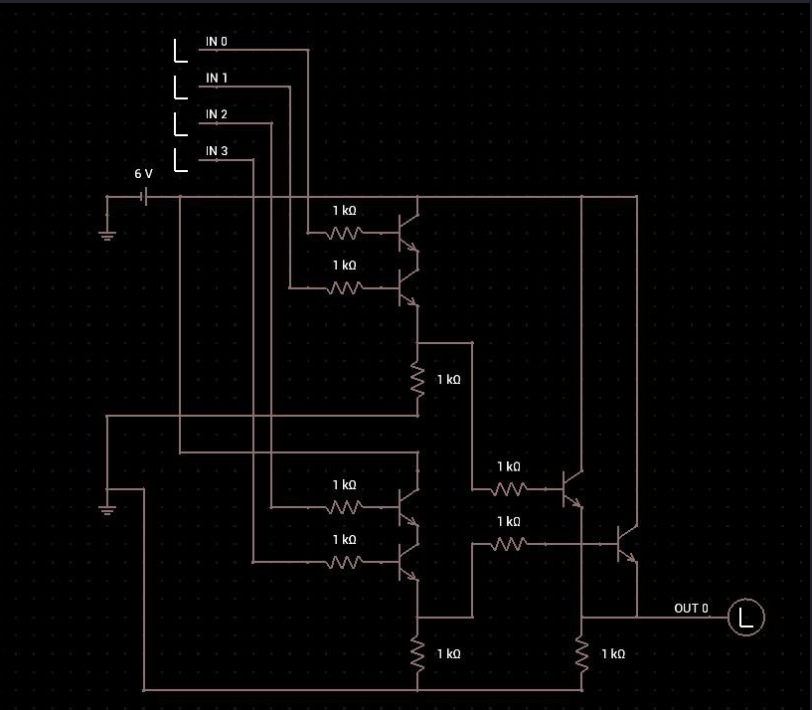

[⬅ Retour à Challenges](README.md) · [🏠 Accueil du repo](../../README.md)

# Low Logic — Hardware (Very Easy)

| | |
|---|---|
| **Catégorie** | Hardware |
| **Difficulté** | Very Easy |
| **Récompense** | 130 XP |

## Scénario

> I have this simple chip, I want you to understand how it's works and then give me the output.

Fichiers fournis :
- `chip.jpg` → schéma du circuit
- `input.csv` → les entrées à tester

## Étape 1 — Extraire les fichiers

```bash
unzip <fichier>.zip
cd hw_lowlogic
ls
# chip.jpg  input.csv
```

## Étape 2 — Ouvrir l’image du circuit

```bash
xdg-open chip.jpg
# ou
eog chip.jpg
# ou
feh chip.jpg
```

Tu obtiens ce schéma :



## Étape 3 — Comprendre le circuit (explication débutant)

Le circuit utilise des **transistors NPN**.  
Un transistor NPN fonctionne comme un interrupteur :

- Si on met **1** sur sa base → il laisse passer le courant
- Si on met **0** → il bloque le courant

### Ce qu’on voit sur le schéma :

**Partie haute (IN0 et IN1)**  
Deux transistors sont branchés **l’un après l’autre** (en série).  
→ Le courant ne passe **que si les deux** sont à 1.  
→ C’est un **ET logique (AND)** :
```
A = IN0 AND IN1
```

**Partie basse (IN2 et IN3)**  
Pareil, deux transistors en série.  
→ Autre **AND** :
```
B = IN2 AND IN3
```

**Ensuite**  
Les deux résultats A et B sont reliés **en parallèle** vers la LED (OUT0).  
→ Dès qu’**au moins un** des deux (A ou B) est à 1, la LED s’allume.  
→ C’est un **OU logique (OR)** :
```
OUT0 = A OR B
```

### Formule finale

```
OUT0 = (IN0 AND IN1) OR (IN2 AND IN3)
```

## Étape 4 — Regarder le fichier d’entrée

```bash
head -10 input.csv
```

Tu verras :
```
in0,in1,in2,in3
1,0,0,1
1,1,0,0
0,1,1,0
...
```

Chaque ligne = une combinaison de 4 bits à tester.

## Étape 5 — Calculer la sortie avec un script Python

Crée un fichier `solve.py` :

```python
import csv

bits = []

with open("input.csv") as f:
    reader = csv.reader(f)
    next(reader)  # on saute la première ligne (le header)

    for row in reader:
        in0 = int(row[0])
        in1 = int(row[1])
        in2 = int(row[2])
        in3 = int(row[3])

        # On applique la logique du circuit
        out = (in0 and in1) or (in2 and in3)
        bits.append(str(int(out)))   # on met 0 ou 1 en texte

# On a maintenant une longue chaîne de 0 et 1
binary = "".join(bits)
print("Binaire :", binary)

# On convertit tous les 8 bits en caractères ASCII
flag = ""
for i in range(0, len(binary), 8):
    octet = binary[i:i+8]
    if len(octet) == 8:
        flag += chr(int(octet, 2))

print("Flag :", flag)
```

Lance le script :

```bash
python3 solve.py
```

## Étape 6 — Flag

```
HTB{4_G00d_Cm05_3x4mpl3}
```

## Résumé ultra-simple

1. Ouvre l’image → comprends que c’est `(IN0 ∧ IN1) ∨ (IN2 ∧ IN3)`
2. Lis le CSV ligne par ligne
3. Calcule le bit de sortie pour chaque ligne
4. Regroupe les bits par 8 → convertis en lettres
5. Tu obtiens le flag

C’est tout !
