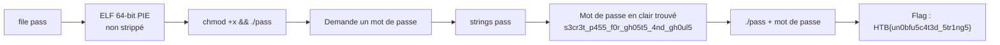
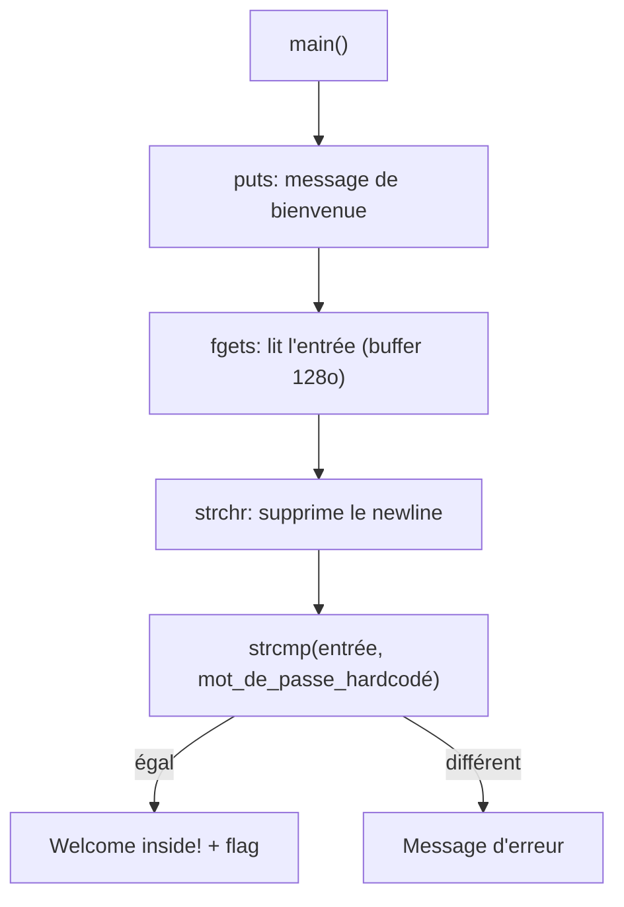

# SpookyPass — Reverse Engineering (Very Easy)

| | |
|---|---|
| **Catégorie** | Reverse Engineering |
| **Difficulté** | Very Easy (Piece of Cake) |
| **Récompense** | 100 XP |
| **Événement** | Hack The Boo / Challenges HTB |

## Scénario

> All the coolest ghosts in town are going to a Haunted Houseparty - can you prove you deserve to get in?

Analyser un binaire Linux (ELF 64-bit) qui demande un mot de passe et trouver le flag.

## Flux de résolution



## Solution pas à pas

**1. Identification du fichier**
```bash
file pass
# ELF 64-bit LSB pie executable, x86-64, dynamiquement lié, non strippé
```

**2. Exécution initiale**
```bash
chmod +x pass
./pass
# Welcome to the SPOOKIEST party of the year.
# Before we let you in, you'll need to give us the password:
```
N'importe quelle entrée → `You're not a real ghost; clear off!`

**3. Analyse statique avec `strings`**
```bash
strings pass
# ... s3cr3t_p455_f0r_gh05t5_4nd_gh0ul5 ...
```
Le mot de passe est en clair dans le binaire.

**4. Validation**
```bash
./pass
# Before we let you in, you'll need to give us the password: s3cr3t_p455_f0r_gh05t5_4nd_gh0ul5
# Welcome inside!
# HTB{un0bfu5c4t3d_5tr1ng5}
```

## Analyse technique (logique du binaire)



Vu en Ghidra/IDA : `puts` → `fgets` → `strchr` → `strcmp` → branche conditionnelle.

**Autres méthodes possibles :**
- `ltrace ./pass` → affiche directement l'appel à `strcmp` avec le mot de passe
- Ghidra / IDA / Binary Ninja → décompilation directe de `main`
- GDB + breakpoint sur `strcmp`

## Flag

```
HTB{un0bfu5c4t3d_5tr1ng5}
```

## Points clés

- Toujours commencer simple : `file`, `strings`, `ltrace` avant d'ouvrir un désassembleur.
- Les chaînes en clair sont très fréquentes dans les challenges débutants.
- `strcmp` est la fonction classique de comparaison de mots de passe — jamais de secret en clair dans un binaire.

## Leçon retenue

Un excellent premier challenge de reverse engineering : familiarisation avec les outils de base (`file`, `strings`, `chmod`) et compréhension du flux d'un programme de vérification de mot de passe.
