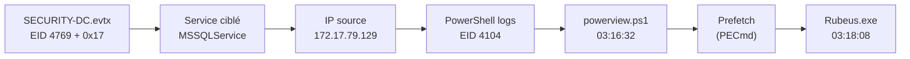

[⬅ Retour à Sherlocks](README.md) · [🏠 Accueil du repo](../../README.md)

# Campfire-1 — DFIR (Very Easy)

| | |
|---|---|
| **Catégorie** | DFIR |
| **Difficulté** | Very Easy |
| **Récompense** | 180 XP |
| **Artefacts** | `SECURITY-DC.evtx`, `Powershell-Operational.evtx`, fichiers Prefetch (`.pf`) |

## Scénario

> Alonzo spotted weird files on his computer and informed the newly assembled SOC team. Assessing the situation, it is believed a Kerberoasting attack may have occurred in the network. It is your job to confirm the findings by analyzing the provided evidence.

## Artefacts fournis

| Fichier | Description |
|---|---|
| `SECURITY-DC.evtx` | Journal de sécurité du contrôleur de domaine `DC01.forela.local` |
| `Powershell-Operational.evtx` | Journal PowerShell de la workstation compromise |
| `C\Windows\prefetch\*.pf` | Fichiers Prefetch de la workstation (preuves d'exécution) |

> L'archive est protégée par un mot de passe (`hacktheblue`) et chiffrée en AES : il faut **7-Zip** pour l'extraire, `Expand-Archive` ne la gère pas.

## Outils

- **Event Viewer** : lecture des `.evtx`
- **PECmd** (Eric Zimmerman) : parsing des fichiers Prefetch
- **Timeline Explorer** (Eric Zimmerman) : lecture et filtrage du CSV produit par PECmd

## Flux de résolution



## Solution pas à pas

### Task 1 — Date et heure du Kerberoasting (UTC)

Dans `SECURITY-DC.evtx`, filtrer sur l'**Event ID 4769** (demande de ticket de service Kerberos). Le journal en contient 16.

Un Kerberoasting se reconnaît à la combinaison suivante :

| Champ | Valeur recherchée | Pourquoi |
|---|---|---|
| `ServiceName` | ni `krbtgt`, ni un nom finissant par `$` | on exclut le TGT et les comptes machine, on garde les comptes de service |
| `TicketEncryptionType` | `0x17` (RC4) | RC4 se casse beaucoup plus vite hors ligne que l'AES (`0x12`) |
| `FailureCode` | `0x0` | la demande a réussi, l'attaquant a bien obtenu le ticket |

Une recherche sur `0x17` fait ressortir un seul événement : un ticket demandé par `alonzo.spire@FORELA.LOCAL`.

**Réponse : `2024-05-21 03:18:09`**

> ⚠️ Event Viewer affiche l'heure **locale** de la machine d'analyse (ici `8:18 AM`). Les réponses HTB sont attendues en **UTC** : la valeur fiable est le champ `SystemTime` de l'onglet *Details*, qui se termine par `Z`.

---

### Task 2 — Service ciblé

Dans le même événement 4769, champ **Service Name**.

**Réponse : `MSSQLService`**

Un compte de service SQL est une cible classique : il a un SPN, son mot de passe est souvent faible et il est parfois très privilégié.

---

### Task 3 — IP de la workstation

Dans le même événement, champ **Client Address**.

```
::ffff:172.17.79.129
```

Le préfixe `::ffff:` indique une adresse IPv4 encapsulée en IPv6, on ne garde que l'IPv4.

**Réponse : `172.17.79.129`**

---

### Task 4 — Fichier utilisé pour énumérer l'Active Directory

On pivote sur la workstation avec `Powershell-Operational.evtx`, en filtrant sur l'**Event ID 4104** (*Script Block Logging*), qui enregistre le contenu complet des scripts exécutés.

Le premier événement, à 03:16:29 UTC, est une commande de contournement de la politique d'exécution :

```
powershell -ep bypass
```

Elle est suivie d'une série de script blocks tous horodatés à la même seconde. Le premier bloc (1 sur 20) contient l'en-tête reconnaissable du script :

```
PowerSploit File: PowerView.ps1
Author: Will Schroeder (@harmj0y)
```

Les événements d'erreur du même journal confirment le chemin : une première tentative de chargement de `C:\Users\alonzo.spire\Downloads\powerview.ps1` échoue (*running scripts is disabled on this system*), d'où le `-ep bypass` juste après.

**Réponse : `powerview.ps1`**

PowerView est un outil d'énumération AD (utilisateurs, groupes, SPN, relations de confiance) qui permet de repérer les comptes Kerberoastables.

---

### Task 5 — Heure d'exécution du script (UTC)

Le premier événement 4104 contenant le script PowerView, onglet *Details* :

```
SystemTime: 2024-05-21T03:16:32.5883403Z
```

**Réponse : `2024-05-21 03:16:32`**

---

### Task 6 — Chemin complet de l'outil de Kerberoasting

Parser les Prefetch avec PECmd :

```powershell
.\PECmd.exe -d "<chemin>\Triage\Workstation\2024-05-21T033012_triage_asset\C\Windows\prefetch" --csv . --csvf analysis.csv
```

Ouvrir `analysis.csv` dans Timeline Explorer, puis :

1. Filtrer la colonne `Last Run` sur le jour de l'incident (`2024-05-21`).
2. Garder les exécutables qui n'ont **pas** de `Previous Run` : ce sont des programmes lancés pour la première fois sur la machine.
3. Un nom ressort : **`RUBEUS.EXE`**, avec un seul lancement.

Le chemin complet se lit dans la colonne `Files Loaded` (double-clic sur la valeur) :

```
\VOLUME{01d951602330db46-52233816}\USERS\ALONZO.SPIRE\DOWNLOADS\RUBEUS.EXE
```

On remplace la partie `\VOLUME{...}` par `C:`.

**Réponse : `C:\Users\Alonzo.spire\Downloads\Rubeus.exe`**

Rubeus est l'outil de référence pour les attaques Kerberos (Kerberoasting, pass-the-ticket, overpass-the-hash, S4U).

---

### Task 7 — Heure d'exécution de Rubeus (UTC)

Colonne `Last Run` de la ligne `RUBEUS.EXE` :

```
2024-05-21 03:18:08
```

**Réponse : `2024-05-21 03:18:08`**

## Timeline de l'attaque

| Heure (UTC) | Source | Événement |
|---|---|---|
| 03:16:29 | PowerShell (EID 4104) | `powershell -ep bypass` : contournement de la politique d'exécution |
| 03:16:32 | PowerShell (EID 4104) | Chargement de `powerview.ps1` (énumération AD) |
| 03:18:08 | Prefetch | Exécution de `Rubeus.exe` depuis `Downloads` |
| 03:18:09 | DC — Security (EID 4769) | Ticket RC4 demandé pour `MSSQLService` depuis `172.17.79.129` |

Rubeus a été lancé **1 seconde** avant que le DC journalise la demande de ticket : la corrélation entre les trois sources est directe.

## Réponses résumées

| Task | Réponse |
|---|---|
| 1 — Date/heure du Kerberoasting | `2024-05-21 03:18:09` |
| 2 — Service ciblé | `MSSQLService` |
| 3 — IP de la workstation | `172.17.79.129` |
| 4 — Fichier d'énumération AD | `powerview.ps1` |
| 5 — Exécution du script | `2024-05-21 03:16:32` |
| 6 — Chemin de l'outil | `C:\Users\Alonzo.spire\Downloads\Rubeus.exe` |
| 7 — Exécution de l'outil | `2024-05-21 03:18:08` |

## Détection

Requête Splunk équivalente au filtre de la Task 1 :

```
Event.System.EventID="4769" Event.EventData.TicketEncryptionType="0x17" Event.EventData.ServiceName!="*$"
| table Event.EventData.ServiceName, Event.EventData.TargetUserName, Event.EventData.IpAddress
```

## Points clés

- **Kerberoasting** : tout utilisateur du domaine peut demander un ticket de service pour n'importe quel SPN, puis le casser hors ligne. Aucun privilège particulier n'est nécessaire.
- Signature dans les logs du DC : **EID 4769** + chiffrement **RC4 (`0x17`)** + service qui n'est ni `krbtgt` ni un compte machine.
- **Script Block Logging (EID 4104)** est précieux : il garde le contenu des scripts même chargés en mémoire, ce qui permet d'identifier l'outil (ici PowerView) et l'heure exacte.
- Le **Prefetch** prouve qu'un programme a été exécuté, avec la date de dernier lancement et les fichiers chargés (donc le chemin complet).
- Astuce Timeline Explorer : filtrer les exécutables **sans `Previous Run`** isole les programmes lancés pour la première fois.
- Penser au **fuseau horaire** : Event Viewer et les outils affichent l'heure locale, alors que les preuves sont en UTC.
- Remédiation : mots de passe longs et aléatoires (ou **gMSA**) pour les comptes de service, chiffrement **AES** uniquement, et alerte sur les demandes de tickets RC4.
