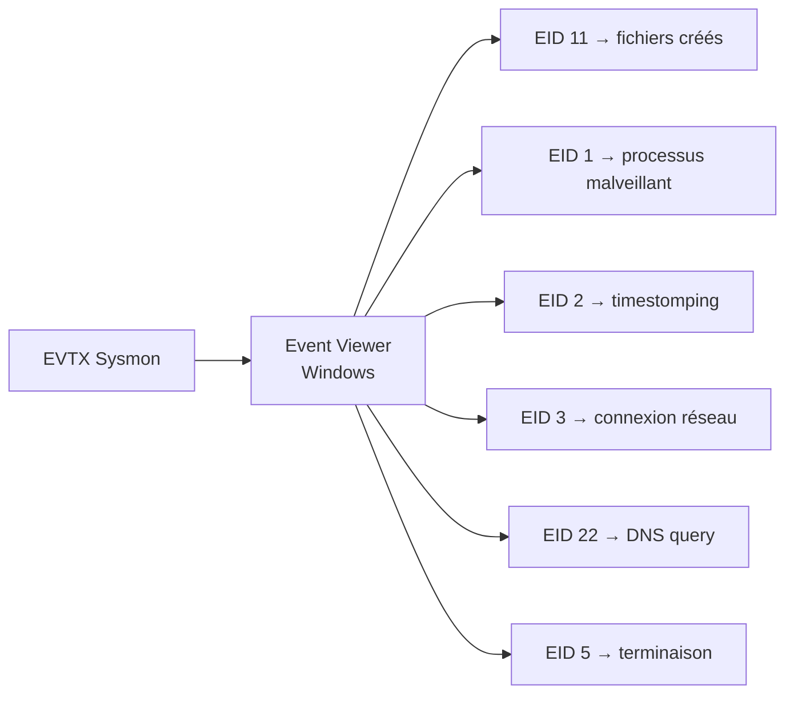

[⬅ Retour à Sherlocks](README.md) · [🏠 Accueil du repo](../../README.md)

# Unit42 — DFIR (Very Easy)

| | |
|---|---|
| **Catégorie** | DFIR |
| **Difficulté** | Very Easy |
| **Récompense** | 195 XP |
| **Artefacts** | `unit42.zip` (logs Sysmon — EVTX) |

## Scénario

> In this Sherlock, you will familiarize yourself with Sysmon logs and various useful EventIDs for identifying and analyzing malicious activities on a Windows system. Palo Alto's Unit42 recently conducted research on an UltraVNC campaign, wherein attackers utilized a backdoored version of UltraVNC to maintain access to systems. This lab is inspired by that campaign and guides participants through the initial access stage of the campaign.

## Artefacts fournis

| Fichier | Description |
|---|---|
| `unit42.zip` | Fichier EVTX Sysmon (logs Windows Event) |

## Event IDs Sysmon utilisés

| Event ID | Description |
|---|---|
| 1 | Process Creation (chemin, parent, arguments) |
| 2 | File Creation Time Changed (timestomping) |
| 3 | Network Connection |
| 5 | Process Termination |
| 11 | File Created |
| 22 | DNS Query |

## Flux de résolution



## Outil utilisé

**Windows Event Viewer** — ouvrir le fichier `.evtx` directement :
1. `Démarrer` → `Event Viewer`
2. `Action` → `Open Saved Log...`
3. Sélectionner le fichier `.evtx` extrait

Filtrer par Event ID : `Action` → `Filter Current Log` → champ **Event ID**.

## Solution pas à pas

### Task 1 — Nombre d'événements EID 11

Filtrer sur **Event ID 11** (File Created).

**Réponse : `56`**

---

### Task 2 — Processus malveillant

Filtrer sur **Event ID 1** (Process Creation).

Le processus malveillant se distingue par :
- Son chemin dans `AppData\Roaming` (zone non-système)
- Son nom trompeur imitant un installeur Microsoft Visual C++
- Son parent = explorer.exe (exécuté manuellement par l'utilisateur)

```
C:\Users\CyberJunkie\AppData\Roaming\Photo and Fax Vn\Photo and vn 1.1.2\install\F2DBC\VC_redist.x64.exe
```

**Réponse : `C:\Users\CyberJunkie\AppData\Roaming\Photo and Fax Vn\Photo and vn 1.1.2\install\F2DBC\VC_redist.x64.exe`**

---

### Task 3 — Service cloud utilisé pour distribuer le malware

Dans les événements EID 11 et EID 1, le chemin source du fichier révèle un dossier OneDrive :

```
C:\Users\CyberJunkie\OneDrive\...
```

**Réponse : `OneDrive`**

---

### Task 4 — Timestamp modifié pour le fichier PDF (timestomping)

Filtrer sur **Event ID 2** (File Creation Time Changed).

Chercher l'entrée concernant un fichier `.pdf`. Le champ `CreationUtcTime` (valeur falsifiée) affiche :

```
2000-01-01 00:00:00
```

Technique de défense évasion : faire paraître le fichier plus ancien pour se fondre dans les fichiers système.

**Réponse : `2000-01-01 00:00:00`**

---

### Task 5 — Chemin de création de `once.cmd`

Filtrer sur **Event ID 11** et chercher `once.cmd` dans le champ `TargetFilename`.

```
C:\Users\CyberJunkie\AppData\Roaming\Photo and Fax Vn\Photo and vn 1.1.2\install\F2DBC\once.cmd
```

**Réponse : `C:\Users\CyberJunkie\AppData\Roaming\Photo and Fax Vn\Photo and vn 1.1.2\install\F2DBC\once.cmd`**

---

### Task 6 — Domaine factice (vérification de connectivité)

Filtrer sur **Event ID 22** (DNS Query).

Le malware interroge un domaine test avant d'agir — pattern classique de vérification de présence internet :

```
www.example.com
```

**Réponse : `www.example.com`**

---

### Task 7 — Adresse IP contactée

Filtrer sur **Event ID 3** (Network Connection) associé au processus malveillant.

L'IP de destination correspond à la résolution de `www.example.com` :

```
93.184.216.34
```

**Réponse : `93.184.216.34`**

---

### Task 8 — Timestamp de terminaison du processus

Filtrer sur **Event ID 5** (Process Termination).

Chercher la terminaison de `VC_redist.x64.exe` (le processus malveillant identifié en Task 2).

```
2024-02-14 03:41:58
```

**Réponse : `2024-02-14 03:41:58`**

## Réponses résumées

| Task | Réponse |
|---|---|
| 1 — Nombre EID 11 | `56` |
| 2 — Processus malveillant | `C:\Users\CyberJunkie\AppData\Roaming\Photo and Fax Vn\Photo and vn 1.1.2\install\F2DBC\VC_redist.x64.exe` |
| 3 — Service cloud | `OneDrive` |
| 4 — Timestamp falsifié (PDF) | `2000-01-01 00:00:00` |
| 5 — Chemin `once.cmd` | `C:\Users\CyberJunkie\AppData\Roaming\Photo and Fax Vn\Photo and vn 1.1.2\install\F2DBC\once.cmd` |
| 6 — Domaine factice | `www.example.com` |
| 7 — IP contactée | `93.184.216.34` |
| 8 — Terminaison processus | `2024-02-14 03:41:58` |

## Points clés

- Les malwares se placent souvent dans `AppData\Roaming` pour éviter d'écrire dans des répertoires système qui nécessitent des droits admin
- Le **timestomping** (EID 2) est une technique d'évasion qui modifie les dates de création pour imiter des fichiers légitimes anciens
- `www.example.com` est une adresse réservée (IANA) souvent utilisée dans les malwares pour tester la connectivité sans alerter les IDS
- UltraVNC backdoordé = outil d'accès à distance légitime modifié pour la persistance (LOLBIN-adjacent)
- Toujours corréler EID 22 (DNS) + EID 3 (connexion) pour reconstruire les communications réseau
