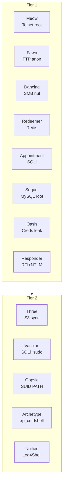

[🏠 Accueil du repo](../../README.md) · [HTB](../) 

# Hack The Box — Starting Point

13 machines résolues avec méthodologie complète, commandes et captures d'écran. Chaque machine a sa propre page (liens dans le tableau ci-dessous), avec navigation précédent / suivant.

**Tier 1 :** Meow · Fawn · Dancing · Redeemer · Appointment · Sequel · Oasis · Responder  
**Tier 2 :** Three · Vaccine · Oopsie · Archetype · Unified

## Résumé des machines

Vue d'ensemble des 13 machines Starting Point résolues, avec le service
et la vulnérabilité principale exploitée pour chacune.

|             |                           |                      |                                     |
|-------------|---------------------------|----------------------|-------------------------------------|
| **Machine** | **Service(s)**            | **Port(s)**          | **Vulnérabilité principale**        |
| Meow        | Telnet                    | 23                   | Root sans mot de passe              |
| Fawn        | FTP                       | 21                   | Login anonyme                       |
| Dancing     | SMB                       | 445                  | Partage public / session nulle      |
| Redeemer    | Redis                     | 6379                 | Pas d'authentification              |
| Appointment | MySQL / Web               | 3306, 80             | Injection SQL                       |
| Sequel      | MySQL                     | 3306                 | Root sans mot de passe              |
| Oasis       | FTP + Web                 | 21, 80               | Fuite de credentials                |
| Responder   | HTTP + WinRM              | 80, 5985             | RFI + capture NTLM                  |
| Three       | HTTP + S3                 | 22, 80               | Bucket S3 sync. webroot             |
| Vaccine     | FTP + Web + PostgreSQL    | 21, 22, 80           | SQLi + sudo vi restreint            |
| Oopsie      | Web (PHP)                 | 22, 80               | Contrôle d'accès + SUID PATH hijack |
| Archetype   | SMB + MSSQL + WinRM (Win) | 445, 1433, 5985      | Credentials en clair + xp_cmdshell  |
| Unified     | UniFi + MongoDB           | 22, 6789, 8080, 8443 | Log4Shell (CVE-2021-44228)          |

## Table des matières

| # | Machine | Tier | Vulnérabilité |
|---|---|---|---|
| 1 | [Meow](labs/01-meow.md) | 1 | Root sans mot de passe (Telnet) |
| 2 | [Fawn](labs/02-fawn.md) | 1 | Login anonyme (FTP) |
| 3 | [Dancing](labs/03-dancing.md) | 1 | Partage public (SMB) |
| 4 | [Redeemer](labs/04-redeemer.md) | 1 | Pas d'authentification (Redis) |
| 5 | [Appointment](labs/05-appointment.md) | 1 | Injection SQL |
| 6 | [Sequel](labs/06-sequel.md) | 1 | Root sans mot de passe (MySQL) |
| 7 | [Oasis](labs/07-oasis.md) | 1 | Fuite de credentials |
| 8 | [Responder](labs/08-responder.md) | 1 | RFI + capture NTLM |
| 9 | [Three](labs/09-three.md) | 2 | Bucket S3 sync. webroot |
| 10 | [Vaccine](labs/10-vaccine.md) | 2 | SQLi + sudo vi restreint |
| 11 | [Oopsie](labs/11-oopsie.md) | 2 | Contrôle d'accès + SUID PATH |
| 12 | [Archetype](labs/12-archetype.md) | 2 | Credentials clair + xp_cmdshell |
| 13 | [Unified](labs/13-unified.md) | 2 | Log4Shell (CVE-2021-44228) |
